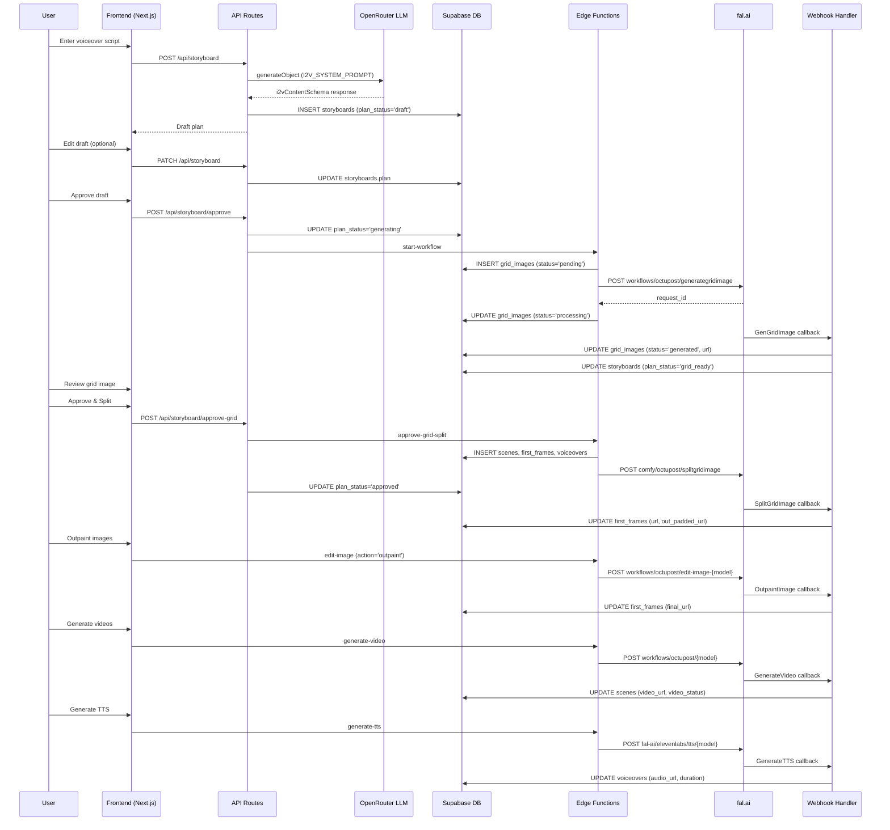

# STORYBOARD_I2V_A.md — Image-to-Video Pipeline Complete Documentation

## Table of Contents
1. [Overview](#overview)
2. [Architecture Diagram](#architecture-diagram)
3. [Schemas](#schemas)
4. [AI Prompts (Verbatim)](#ai-prompts-verbatim)
5. [Step-by-Step Flow](#step-by-step-flow)
6. [Database Tables & State Tracking](#database-tables--state-tracking)
7. [API Routes](#api-routes)
8. [Supabase Edge Functions](#supabase-edge-functions)
9. [Webhook Handler](#webhook-handler)
10. [Frontend Components](#frontend-components)
11. [Supporting Libraries](#supporting-libraries)
12. [Error Handling](#error-handling)

---

## Overview

The Image-to-Video (I2V) pipeline generates short-form videos from a voiceover script. The flow is:

1. User provides a voiceover script text
2. LLM generates a storyboard plan (grid layout, voiceover segments, visual flow prompts)
3. User reviews/edits the draft plan
4. User approves → grid image is generated via fal.ai
5. User reviews grid image, adjusts rows/cols if needed
6. User approves grid → grid is split into individual scene images via ComfyUI
7. Scene images are outpainted to target aspect ratio
8. Videos are generated from outpainted images using I2V models (wan2.6, bytedance1.5pro, grok)
9. TTS voiceovers are generated via ElevenLabs (through fal.ai)
10. Optional: SFX generation, image enhancement

---

## Architecture Diagram



---

## Schemas

### i2vContentSchema (LLM output schema)

**File:** `editor/src/lib/schemas/i2v-plan.ts`

```typescript
export const i2vContentSchema = z.object({
  rows: z.number(),
  cols: z.number(),
  grid_image_prompt: z.string(),
  voiceover_list: z.array(z.string()),
  visual_flow: z.array(z.string()),
});
```

The LLM generates `voiceover_list` as a flat array. After generation, it is wrapped into a language-keyed record:

```typescript
const finalPlan = {
  rows: content.rows,
  cols: content.cols,
  grid_image_prompt: `${I2V_GRID_PROMPT_PREFIX} ${content.grid_image_prompt}`,
  voiceover_list: { [sourceLanguage]: content.voiceover_list },
  visual_flow: content.visual_flow,
};
```

### i2vPlanSchema (stored plan schema — after language wrapping)

```typescript
export const i2vPlanSchema = z.object({
  rows: z.number(),
  cols: z.number(),
  grid_image_prompt: z.string(),
  voiceover_list: z.record(z.string(), z.array(z.string())),
  visual_flow: z.array(z.string()),
});
```

### I2VPlan type

```typescript
export type I2VPlan = z.infer<typeof i2vPlanSchema>;
```

---

## AI Prompts (Verbatim)

### I2V_SYSTEM_PROMPT

**File:** `editor/src/lib/schemas/i2v-plan.ts`

```
You are a professional storyboard generator for moral stories video production. Given a voiceover script, generate a realistic storyboard breakdown.

Rules:
1. Voiceover Splitting and Grid Planning
Target 4-12 seconds of speech per segment.
Adjust your splitting strategy so the total segment count matches one of the valid grid sizes below. The squarest possible grid like  4x4(16), 5x5(25) that fits the segment count is preferred, but you can choose any valid grid size as long as it matches the segment count exactly.
Valid grid sizes are: 2x2(4), 3x2(6), 3x3(9), 4x3(12), 4x4(16), 5x4(20), 5x5(25), 6x5(30), 6x6(36)
Grid Image Prompt Format: "With 2 A [Rows]x[Cols] Grids. Grid_1x1: [Full description], Grid_1x2: [Full description]..."
Describe EVERY cell with
DO:
- The prompts will be english but the the texts and style on the iamge will be depeding on the language of the voiceover.
- If there is a human in the scene the face must be shown in the grid cell.
- Use modern islamic clothing styles if people are shown in the scenes.
- For girls use modest clothing with NO Hijab.
- The clothing should be modern muslim fashion styles like Turkey without any religious symbols.
DO NOT DO:
- Do not add any extra text like a message or overlay text no text will be seen on the grid cell,
- Do not add any violence ex: blood.

2. Visual Flow (Image-to-Video Prompts)
One prompt per cell describing how to animate that static frame into video.
Reference what is visible in the first frame and describe the action/movement from there.
When you create grid first frame and visual flow consider it will start first frame and do tha action.
The flow will be english for better prompting but if there is conversation add those in the language of the voiceover and indicate which character is saying what in the visual flow prompt.

3. Real References
If the voiceover mentions real people, brands, landmarks, or locations, use their actual names and recognizable features.

Output:
Return ONLY valid JSON:
{
"rows": <number>,
"cols": <number>,
"grid_image_prompt": "<string>",
"voiceover_list": ["<string>", ...],
"visual_flow": ["<string>", ...]
}
```

### I2V_GRID_PROMPT_PREFIX

**File:** `editor/src/lib/schemas/i2v-plan.ts`

```
Cinematic realistic style.
Grid image with each cell will be in the same size with 1px black grid lines.
```

This prefix is prepended to the LLM-generated `grid_image_prompt` before storing:
```typescript
grid_image_prompt: `${I2V_GRID_PROMPT_PREFIX} ${content.grid_image_prompt}`,
```

### EDIT_PROMPT (Outpaint)

**File:** `supabase/functions/edit-image/index.ts`

```
Seamlessly extend the image into all masked areas. Fill every masked pixel completely. No borders, frames, panels, black bars, blank areas, transparent areas, or unfilled regions. No new subjects, text, watermarks, seams, or visible edges. Maintain the same scene, style, color palette, and perspective throughout.
```

### ENHANCE_PROMPT

**File:** `supabase/functions/edit-image/index.ts`

```
Improve quality to 8k Do not change the image but fix the objects to make it more real
```

---

## Step-by-Step Flow

### Step 1: Plan Generation

**User Action:** User enters voiceover script text, selects LLM model, aspect ratio, mode = `image_to_video`, source language.

**Frontend:** `editor/src/components/editor/media-panel/panel/storyboard.tsx` — `handleGenerate()` function.

**API Call:** `POST /api/storyboard`

**File:** `editor/src/app/api/storyboard/route.ts`

**Request body:**
```json
{
  "voiceoverText": "...",
  "model": "google/gemini-3.1-pro-preview",
  "projectId": "uuid",
  "aspectRatio": "9:16",
  "mode": "image_to_video",
  "sourceLanguage": "en"
}
```

**Valid LLM models:**
```typescript
const VALID_MODELS = [
  'google/gemini-3.1-pro-preview',
  'anthropic/claude-opus-4.6',
  'openai/gpt-5.2-pro',
  'z-ai/glm-5',
] as const;
```

**LLM Call:**
```typescript
const openrouter = createOpenRouter({
  apiKey: process.env.OPENROUTER_API_KEY,
});

const { object: content } = await generateObjectWithFallback({
  primaryModel: model,
  primaryOptions: {
    plugins: [{ id: 'response-healing' }],
    ...(isOpus(model) ? {} : { reasoning: { effort: 'high' } }),
  },
  system: I2V_SYSTEM_PROMPT,
  prompt: userPrompt,
  schema: i2vContentSchema,
  label: 'i2v/content',
});
```

**User prompt sent to LLM:**
```
Voiceover Script:
${voiceoverText}

Generate the storyboard.
```

**Fallback model:**
```typescript
const STORYBOARD_BACKUP_MODEL = 'stepfun/step-3.5-flash:free';
```

The `generateObjectWithFallback` function tries the primary model first, and on failure retries with the backup model using `{ plugins: [{ id: 'response-healing' }] }`.

**Validation:**
- `rows` and `cols` must be between 2 and 8
- `rows` must equal `cols` or `cols + 1` (near-square constraint)
- `voiceover_list.length` must equal `rows * cols`
- `visual_flow.length` must equal `rows * cols`

**Database insert:**
```typescript
const { data: storyboard } = await supabase
  .from('storyboards')
  .insert({
    project_id: projectId,
    voiceover: voiceoverText,
    aspect_ratio: aspectRatio,
    plan: finalPlan,
    plan_status: 'draft',
  })
  .select()
  .single();
```

**Response:**
```json
{
  "rows": 4,
  "cols": 4,
  "grid_image_prompt": "Cinematic realistic style...",
  "voiceover_list": { "en": ["...", "..."] },
  "visual_flow": ["...", "..."],
  "storyboard_id": "uuid"
}
```

### Step 2: Draft Review & Edit (Optional)

**User Action:** User can view and edit the plan in `draft-plan-editor.tsx`. They can modify `grid_image_prompt`, `visual_flow` prompts, and `voiceover_list` entries.

**API Call:** `PATCH /api/storyboard`

**File:** `editor/src/app/api/storyboard/route.ts` (PATCH handler)

**Request body:**
```json
{
  "storyboardId": "uuid",
  "plan": { /* updated plan object */ }
}
```

**Validation:** Plan is validated against `i2vPlanSchema`. Must be in `draft` status.

### Step 3: Approve Draft → Generate Grid Image

**User Action:** Click "Approve & Generate" button.

**Frontend:** `storyboard.tsx` — `handleApproveDraft()` function. First PATCHes the plan, then POSTs to approve.

**API Call:** `POST /api/storyboard/approve`

**File:** `editor/src/app/api/storyboard/approve/route.ts`

**Process:**
1. Validates `plan_status === 'draft'`
2. Updates `plan_status` to `'generating'`
3. Resolves dimensions from aspect ratio:
   ```typescript
   const ASPECT_RATIOS: Record<string, { width: number; height: number }> = {
     '16:9': { width: 1920, height: 1080 },
     '9:16': { width: 1080, height: 1920 },
     '1:1': { width: 1080, height: 1080 },
   };
   ```
4. Calls `start-workflow` edge function with body:
   ```json
   {
     "storyboard_id": "uuid",
     "project_id": "uuid",
     "rows": 4,
     "cols": 4,
     "grid_image_prompt": "Cinematic realistic style...",
     "voiceover_list": { "en": ["..."] },
     "visual_prompt_list": ["..."],
     "width": 1080,
     "height": 1920,
     "voiceover": "full original script",
     "aspect_ratio": "9:16"
   }
   ```

### Step 4: start-workflow Edge Function

**File:** `supabase/functions/start-workflow/index.ts`

**Process:**
1. Validates input (rows/cols in 2-8, near-square constraint, array lengths match `rows*cols`)
2. Creates `grid_images` record:
   ```typescript
   await supabase.from('grid_images').insert({
     storyboard_id,
     prompt: grid_image_prompt,
     status: 'pending',
     detected_rows: rows,
     detected_cols: cols,
     dimension_detection_status: 'success',
   });
   ```
3. Builds webhook URL with params:
   ```
   ${SUPABASE_URL}/functions/v1/webhook?step=GenGridImage&grid_image_id=...&storyboard_id=...&rows=...&cols=...&width=...&height=...
   ```
4. Sends fal.ai request:
   ```
   POST https://queue.fal.run/workflows/octupost/generategridimage?fal_webhook=...
   Headers: Authorization: Key ${FAL_API_KEY}
   Body: { "prompt": grid_image_prompt }
   ```
5. Updates `grid_images` status to `'processing'`

### Step 5: Webhook — GenGridImage

**File:** `supabase/functions/webhook/index.ts` — `handleGenGridImage()`

**Trigger:** fal.ai calls webhook with completed grid image.

**Process:**
1. Extracts image URL from fal.ai payload (checks `payload.images`, `images`, `payload.outputs.images`, `outputs.images`, and ComfyUI node outputs)
2. If failed: Updates `grid_images` status to `'failed'`
3. If success:
   - Updates `grid_images` to `status: 'generated'`, stores URL
   - Updates `storyboards.plan_status` to `'grid_ready'`

### Step 6: Grid Image Review

**User Action:** User sees the generated grid image. Can adjust rows/cols and either Approve & Split or Regenerate.

**Frontend:** `editor/src/components/editor/media-panel/panel/grid-image-review.tsx`

**Regenerate path:** `POST /api/storyboard/regenerate-grid`
- Deletes old `grid_images` records
- Sets `plan_status` back to `'generating'`
- Re-invokes `start-workflow` with same plan data

### Step 7: Approve Grid → Split into Scenes

**User Action:** Click "Approve & Split".

**API Call:** `POST /api/storyboard/approve-grid`

**File:** `editor/src/app/api/storyboard/approve-grid/route.ts`

**Process:**
1. Validates `plan_status === 'grid_ready'` and `gridImage.status === 'generated'`
2. If rows/cols changed by user:
   - Adjusts `voiceover_list` arrays (truncate or extend with last element)
   - Adjusts `visual_flow` array (truncate or extend with last element)
   - Updates plan in DB
3. Calls `approve-grid-split` edge function

### Step 8: approve-grid-split Edge Function

**File:** `supabase/functions/approve-grid-split/index.ts`

**Process:**
1. Creates `scenes` records (one per grid cell, with `order = i`):
   ```typescript
   for (let i = 0; i < expectedScenes; i++) {
     const { data: scene } = await supabase
       .from('scenes')
       .insert({ storyboard_id, order: i })
       .select().single();

     await supabase.from('first_frames').insert({
       scene_id: scene.id,
       grid_image_id,
       visual_prompt: visual_prompt_list[i],
       status: 'processing',
     });

     for (const lang of languages) {
       await supabase.from('voiceovers').insert({
         scene_id: scene.id,
         text: voiceover_list[lang][i],
         language: lang,
         status: 'success',
       });
     }
   }
   ```
2. Sends split request to ComfyUI:
   ```
   POST https://queue.fal.run/comfy/octupost/splitgridimage?fal_webhook=...
   Body: {
     "loadimage_1": grid_image_url,
     "rows": rows,
     "cols": cols,
     "width": width,
     "height": height
   }
   ```
   Webhook URL includes: `step=SplitGridImage&grid_image_id=...&storyboard_id=...`

### Step 9: Webhook — SplitGridImage

**File:** `supabase/functions/webhook/index.ts` — `handleSplitGridImage()` → `handleSceneSplit()`

**Process:**
1. Determines grid type (for I2V, it's `'scene'` type — no `type` field on the grid_images record)
2. Extracts images from ComfyUI node outputs:
   - **Node 30** (`getImagesFromNode(falPayload, '30')`): Split scene images → stored as `url`
   - **Node 11** (`getImagesFromNode(falPayload, '11')`): Padded/outpainted images → stored as `out_padded_url`
3. Fetches scenes ordered by `order`, matches with images by index
4. Updates `first_frames` for each scene:
   ```typescript
   await supabase.from('first_frames').update({
     url: imageUrl,          // from node 30
     out_padded_url: outPaddedUrl,  // from node 11
     grid_image_id,
     status: imageUrl || outPaddedUrl ? 'success' : 'failed',
   }).eq('id', firstFrame.id);
   ```

### Step 10: Image Outpaint

**User Action:** Click outpaint button on scene cards.

**Frontend:** `storyboard-cards.tsx` — calls `edit-image` edge function.

**Edge Function:** `supabase/functions/edit-image/index.ts`

**Outpaint models and endpoints:**
```typescript
const EDIT_ENDPOINTS: Record<string, string> = {
  kling: 'workflows/octupost/edit-image-kling',
  banana: 'workflows/octupost/edit-image-banana',
  fibo: 'workflows/octupost/edit-image-fibo',
  grok: 'workflows/octupost/edit-image-grok',
  'flux-pro': 'workflows/octupost/edit-image-flux-pro',
};
```

**For outpaint action:**
- Uses `out_padded_url` from `first_frames` as source
- Sends to fal.ai with `EDIT_PROMPT`
- Webhook step: `OutpaintImage`
- On success: stores result as `outpainted_url` and `final_url` on `first_frames`

**For enhance action:**
- Uses `final_url` from `first_frames` as source
- Sends to fal.ai with `ENHANCE_PROMPT`
- Webhook step: `EnhanceImage`
- On success: updates `final_url` on `first_frames`

**For custom_edit action:**
- Uses `final_url` from `first_frames` as source
- Sends to fal.ai with user-provided prompt
- Webhook step: `EnhanceImage`

**Request body format varies by model:**
- `fibo` and `grok`: `{ image_url: "...", prompt: "..." }`
- Others: `{ image_urls: ["..."], prompt: "..." }`

### Step 11: Video Generation

**User Action:** Click generate video on scene cards.

**Frontend:** `storyboard-cards.tsx` — calls `generate-video` edge function.

**Edge Function:** `supabase/functions/generate-video/index.ts`

**I2V Model configurations:**
```typescript
const MODEL_CONFIG = {
  'wan2.6': {
    endpoint: 'workflows/octupost/wan26',
    mode: 'image_to_video',
    validResolutions: ['720p', '1080p'],
    bucketDuration: (raw) => (raw <= 5 ? 5 : raw <= 10 ? 10 : 15),
    buildPayload: ({ prompt, image_url, resolution, duration }) => ({
      prompt,
      image_url,
      resolution,
      duration: String(duration),
    }),
  },
  'bytedance1.5pro': {
    endpoint: 'workflows/octupost/bytedancepro15',
    mode: 'image_to_video',
    validResolutions: ['480p', '720p', '1080p'],
    bucketDuration: (raw) => Math.max(4, Math.min(12, raw)),
    buildPayload: ({ prompt, image_url, resolution, duration, aspect_ratio }) => ({
      prompt,
      image_url,
      aspect_ratio: aspect_ratio ?? '16:9',
      resolution,
      duration: String(duration),
    }),
  },
  grok: {
    endpoint: 'workflows/octupost/grok',
    mode: 'image_to_video',
    validResolutions: ['480p', '720p'],
    bucketDuration: (raw) => Math.max(1, Math.min(15, raw)),
    buildPayload: ({ prompt, image_url, resolution, duration }) => ({
      prompt,
      image_url,
      resolution,
      duration: String(duration),
    }),
  },
};
```

**Default model:** `'bytedance1.5pro'`

**Process (I2V path via `getVideoContext`):**
1. Fetches scene with `first_frames` (needs `final_url`) and `voiceovers` (needs `duration`)
2. Skips if `video_status === 'processing'` (already in progress)
3. Calculates duration: `Math.ceil(max voiceover duration)` → bucketed by model's `bucketDuration`
4. Falls back to `fallback_duration` if no voiceover duration available
5. Sets `video_status = 'processing'` on scene
6. Sends fal.ai request:
   ```
   POST https://queue.fal.run/workflows/octupost/{model}?fal_webhook=...
   Body: { prompt, image_url, resolution, duration }
   ```
   Webhook: `step=GenerateVideo&scene_id=...`
7. 1-second delay between sequential scene requests

### Step 12: Webhook — GenerateVideo

**File:** `supabase/functions/webhook/index.ts` — `handleGenerateVideo()`

**Process:**
1. Extracts video URL from payload (checks `payload.video`, `video`, `outputs.video`, ComfyUI node outputs; handles both array and single object)
2. On success: Updates scene with `video_status: 'success'`, `video_url`
3. On failure: Updates scene with `video_status: 'failed'`, `video_error_message: 'generation_error'`

### Step 13: TTS Generation

**User Action:** Click generate TTS on scene cards.

**Edge Function:** `supabase/functions/generate-tts/index.ts`

**TTS models and endpoints:**
```typescript
const TTS_ENDPOINTS: Record<string, string> = {
  'turbo-v2.5': 'fal-ai/elevenlabs/tts/turbo-v2.5',
  'multilingual-v2': 'fal-ai/elevenlabs/tts/multilingual-v2',
};
```

**Default TTS model:** `'multilingual-v2'`

**Default voice:** `'pNInz6obpgDQGcFmaJgB'`

**Process:**
1. Fetches scene with voiceover text for the requested language
2. Fetches sibling scenes for `previous_text` and `next_text` context continuity
3. Updates voiceover `status = 'processing'`
4. Sends TTS request:
   ```
   POST https://queue.fal.run/fal-ai/elevenlabs/tts/{model}?fal_webhook=...
   Body: {
     "text": voiceover text,
     "voice": voice_id,
     "stability": 0.5,
     "similarity_boost": 0.75,
     "speed": speed (clamped 0.7-1.2),
     "previous_text": previous scene voiceover text (or null),
     "next_text": next scene voiceover text (or null)
   }
   ```
   Webhook: `step=GenerateTTS&voiceover_id=...`

### Step 14: Webhook — GenerateTTS

**File:** `supabase/functions/webhook/index.ts` — `handleGenerateTTS()`

**Process:**
1. Extracts audio URL from payload
2. Fetches audio file and calculates duration using `music-metadata` library:
   ```typescript
   const metadata = await musicMetadata.parseBuffer(uint8Array);
   duration = metadata.format.duration ?? null;
   ```
3. If duration calculation fails: marks voiceover as `'failed'` with `'duration_error'`
4. On success: Updates voiceover with `status: 'success'`, `audio_url`, `duration`

### Step 15: SFX Generation (Optional)

**Edge Function:** `supabase/functions/generate-sfx/index.ts`

**Process:**
1. Requires `video_status === 'success'` and `video_url` to exist
2. Sends to fal.ai:
   ```
   POST https://queue.fal.run/workflows/octupost/sfx?fal_webhook=...
   Body: {
     "video_url": scene video URL,
     "prompt": optional SFX prompt from scene.sfx_prompt
   }
   ```
   Webhook: `step=GenerateSFX&scene_id=...`
3. On success: Updates `sfx_status: 'success'` and **overwrites** `video_url` with the SFX-enhanced version

---

## Database Tables & State Tracking

### `storyboards` table
| Column | Type | Description |
|--------|------|-------------|
| id | uuid | Primary key |
| project_id | uuid | FK to projects |
| voiceover | text | Original script text |
| aspect_ratio | text | '16:9', '9:16', '1:1' |
| plan | jsonb | The storyboard plan (I2VPlan schema) |
| plan_status | text | Status lifecycle (see below) |
| mode | text | null or 'image_to_video' for I2V |
| model | text | null for I2V |

**plan_status lifecycle (I2V):**
```
draft → generating → grid_ready → approved
                  ↘ failed
```

- `draft`: Plan generated by LLM, user can edit
- `generating`: Grid image being generated by fal.ai
- `grid_ready`: Grid image ready for user review
- `approved`: Grid split into scenes (happens via approve-grid-split, then webhook sets it)
- `failed`: Generation failed

### `grid_images` table
| Column | Type | Description |
|--------|------|-------------|
| id | uuid | Primary key |
| storyboard_id | uuid | FK to storyboards |
| prompt | text | Grid generation prompt |
| status | text | pending → processing → generated / failed |
| url | text | Generated grid image URL |
| detected_rows | int | Grid rows |
| detected_cols | int | Grid cols |
| dimension_detection_status | text | 'success' |
| request_id | text | fal.ai request ID |
| split_request_id | text | ComfyUI split request ID |
| type | text | null for I2V (used by ref-to-video) |

### `scenes` table
| Column | Type | Description |
|--------|------|-------------|
| id | uuid | Primary key |
| storyboard_id | uuid | FK to storyboards |
| order | int | Scene position (0-indexed) |
| video_status | text | null → processing → success / failed |
| video_url | text | Generated video URL |
| video_request_id | text | fal.ai request ID |
| video_resolution | text | '720p', '1080p' |
| video_error_message | text | Error details |
| sfx_status | text | null → processing → success / failed |
| sfx_prompt | text | Optional SFX prompt |
| sfx_request_id | text | fal.ai request ID |
| sfx_error_message | text | Error details |

### `first_frames` table
| Column | Type | Description |
|--------|------|-------------|
| id | uuid | Primary key |
| scene_id | uuid | FK to scenes |
| grid_image_id | uuid | FK to grid_images |
| visual_prompt | text | Visual flow prompt for this scene |
| status | text | processing → success / failed |
| url | text | Split image URL (node 30) |
| out_padded_url | text | Padded image URL (node 11) |
| outpainted_url | text | Outpainted image URL |
| final_url | text | Current best image URL (used for video gen) |
| image_edit_status | text | null / outpainting / enhancing / editing / success / failed |
| image_edit_request_id | text | fal.ai request ID |
| image_edit_error_message | text | Error details |
| error_message | text | Split error details |

### `voiceovers` table
| Column | Type | Description |
|--------|------|-------------|
| id | uuid | Primary key |
| scene_id | uuid | FK to scenes |
| text | text | Voiceover text |
| language | text | Language code |
| status | text | success / processing / pending / failed |
| audio_url | text | Generated audio URL |
| duration | float | Audio duration in seconds |
| request_id | text | fal.ai request ID |
| error_message | text | Error details |

---

## API Routes

### POST /api/storyboard
- **File:** `editor/src/app/api/storyboard/route.ts`
- **Purpose:** Generate storyboard plan from voiceover script
- **Auth:** Requires Supabase auth (`getUser()`)
- **Flow:** Calls OpenRouter LLM → validates → inserts draft storyboard

### PATCH /api/storyboard
- **File:** `editor/src/app/api/storyboard/route.ts`
- **Purpose:** Update draft plan
- **Constraint:** `plan_status === 'draft'`

### DELETE /api/storyboard
- **File:** `editor/src/app/api/storyboard/route.ts`
- **Purpose:** Delete storyboard by ID

### POST /api/storyboard/approve
- **File:** `editor/src/app/api/storyboard/approve/route.ts`
- **Purpose:** Approve draft → trigger grid image generation
- **Flow:** Updates `plan_status` to `'generating'` → calls `start-workflow` edge function

### POST /api/storyboard/approve-grid
- **File:** `editor/src/app/api/storyboard/approve-grid/route.ts`
- **Purpose:** Approve generated grid → trigger split into scenes
- **Flow:** Adjusts plan if dimensions changed → calls `approve-grid-split` → sets `plan_status = 'approved'`

### POST /api/storyboard/regenerate-grid
- **File:** `editor/src/app/api/storyboard/regenerate-grid/route.ts`
- **Purpose:** Regenerate the grid image
- **Flow:** Deletes old `grid_images` → sets `plan_status = 'generating'` → re-invokes `start-workflow`

---

## Supabase Edge Functions

### start-workflow
- **File:** `supabase/functions/start-workflow/index.ts`
- **fal.ai endpoint:** `workflows/octupost/generategridimage`
- **Payload:** `{ "prompt": grid_image_prompt }`
- **Webhook step:** `GenGridImage`

### approve-grid-split
- **File:** `supabase/functions/approve-grid-split/index.ts`
- **fal.ai endpoint:** `comfy/octupost/splitgridimage`
- **Payload:** `{ "loadimage_1": url, "rows": n, "cols": n, "width": n, "height": n }`
- **Webhook step:** `SplitGridImage`
- **Creates:** scenes, first_frames, voiceovers

### generate-video
- **File:** `supabase/functions/generate-video/index.ts`
- **I2V endpoints:** `workflows/octupost/wan26`, `workflows/octupost/bytedancepro15`, `workflows/octupost/grok`
- **Webhook step:** `GenerateVideo`

### generate-tts
- **File:** `supabase/functions/generate-tts/index.ts`
- **Endpoints:** `fal-ai/elevenlabs/tts/turbo-v2.5`, `fal-ai/elevenlabs/tts/multilingual-v2`
- **Webhook step:** `GenerateTTS`

### generate-sfx
- **File:** `supabase/functions/generate-sfx/index.ts`
- **Endpoint:** `workflows/octupost/sfx`
- **Webhook step:** `GenerateSFX`

### edit-image
- **File:** `supabase/functions/edit-image/index.ts`
- **Endpoints:** `workflows/octupost/edit-image-{kling|banana|fibo|grok|flux-pro}`
- **Webhook steps:** `OutpaintImage` (outpaint) / `EnhanceImage` (enhance/custom_edit)

### webhook
- **File:** `supabase/functions/webhook/index.ts`
- **Routes by `step` param:** GenGridImage, SplitGridImage, GenerateVideo, GenerateTTS, GenerateSFX, OutpaintImage, EnhanceImage

---

## Frontend Components

### storyboard.tsx
- **File:** `editor/src/components/editor/media-panel/panel/storyboard.tsx`
- Main component. Contains form for voiceover text, model selection, aspect ratio, video mode toggle.
- `handleGenerate()`: POSTs to `/api/storyboard`
- `handleApproveDraft()`: PATCHes plan then POSTs to `/api/storyboard/approve`

### grid-image-review.tsx
- **File:** `editor/src/components/editor/media-panel/panel/grid-image-review.tsx`
- Shows generated grid image
- Allows rows/cols adjustment
- "Approve & Split" button: calls `/api/storyboard/approve-grid`
- "Regenerate" button: calls `/api/storyboard/regenerate-grid`

### draft-plan-editor.tsx
- **File:** `editor/src/components/editor/media-panel/panel/draft-plan-editor.tsx`
- Editable form for I2V plans: grid_image_prompt, visual_flow entries, voiceover_list entries
- Distinguishes I2V plans (has `grid_image_prompt`, `visual_flow`) from Ref plans

### storyboard-cards.tsx
- **File:** `editor/src/components/editor/media-panel/panel/storyboard-cards.tsx`
- Lists scene cards with action buttons for video generation, TTS, outpaint, enhance, SFX, custom edit
- Calls edge functions directly via `supabase.functions.invoke()`

### scene-card.tsx
- **File:** `editor/src/components/editor/media-panel/panel/scene-card.tsx`
- Individual scene display: image preview, video preview, voiceover playback
- `parseMultiShotPrompt()`: detects JSON array prompts (for ref-to-video compatibility)

### store.ts
- **File:** `editor/src/components/editor/media-panel/store.ts`
- Zustand store for media panel tab management
- Default active tab: `'storyboard'`
- Tabs include: uploads, images, videos, music, voiceovers, sfx, text, captions, transitions, effects, assistant, storyboard, renders

---

## Supporting Libraries

### workflow-service.ts
- **File:** `editor/src/lib/supabase/workflow-service.ts`
- TypeScript types: `Storyboard`, `StoryboardPlan`, `GridImage`, `FirstFrame`, `Voiceover`, `Scene`, `StoryboardWithScenes`, etc.
- CRUD functions: `getLatestStoryboardWithScenes()`, `getStoryboardWithScenesById()`, `getLatestStoryboard()`
- Real-time subscription: `subscribeToSceneUpdates()` — subscribes to `grid_images`, `first_frames`, `scenes`, `voiceovers`, `storyboards` table changes

### use-workflow.ts
- **File:** `editor/src/hooks/use-workflow.ts`
- React hook `useWorkflow()` for fetching and subscribing to workflow data
- Derives `isProcessing`, `isSplitting`, `isComplete` states
- `isSplitting` for I2V: true when `first_frames` have `status='processing'` and no `url`
- `isComplete` for I2V: true when grid image is `'success'` and all `first_frames` are `'success'` or `'failed'`

### timeline-service.ts
- **File:** `editor/src/lib/supabase/timeline-service.ts`
- `saveTimeline()`, `loadTimeline()`, `clearTimeline()`, `copyTimeline()`
- Multi-language timeline support
- `getAvailableLanguages()`: Merges languages from tracks, voiceovers, and storyboard plans

### scene-timeline-utils.ts
- **File:** `editor/src/lib/scene-timeline-utils.ts`
- `addSceneToTimeline()`: Adds video + optional audio clip to studio timeline
  - Matches video duration to voiceover via `playbackRate` adjustment
  - `MAX_SPEED = 2.0` for video speedup
- `addVoiceoverToTimeline()`: Adds audio-only clip
- `regenerateVoiceover()`: Regenerates TTS and replaces audio clip via realtime subscription
- `getVoiceoverForClip()`: Looks up voiceover by `clip.style.voiceoverId` or `clip.src`

---

## Error Handling

### LLM Generation Failures
- Primary model fails → automatic retry with `stepfun/step-3.5-flash:free` backup
- Zod validation errors return 500 with `details: error.issues`
- API error details extracted from OpenRouter error response

### fal.ai Request Failures
- Grid image: `grid_images.status` set to `'failed'`, `error_message: 'request_error'`
- Video: `scenes.video_status` set to `'failed'`, `video_error_message: 'request_error'`
- TTS: `voiceovers.status` set to `'failed'`, `error_message: 'request_error'`
- Outpaint: `first_frames.image_edit_status` set to `'failed'`

### Webhook Failures
- All webhook handlers return HTTP 200 even on failure (to prevent fal.ai retries)
- Failed status stored in DB with `'generation_error'` message
- Debug payloads stored in `debug_logs` table for troubleshooting

### Edge Function Invocation Failures
- `start-workflow` failure: Reverts `plan_status` to `'draft'`
- `approve-grid-split` split request failure: Marks all `first_frames` as `'failed'`
- `regenerate-grid` failure: Reverts `plan_status` to `'grid_ready'`

### Grid Dimension Validation
- I2V grids: rows must be 2-8, cols must be 2-8, `rows === cols || rows === cols + 1`
- Invalid dimensions from webhook: `grid_images.status` set to `'failed'`
