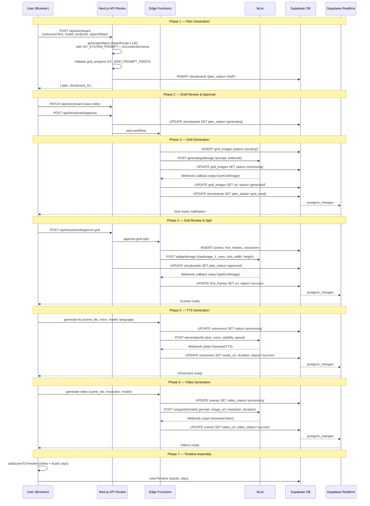

# STORYBOARD_I2V_B — Image-to-Video Pipeline

## 1. Overview

The Image-to-Video (I2V) pipeline generates short-form videos from a voiceover script. An LLM breaks the script into scenes, plans a grid image containing one first-frame per scene, then the system generates the grid, splits it into individual frames, and converts each frame into a video clip synchronized with TTS voiceover audio. The entire flow is event-driven: fal.ai sends webhook callbacks to Supabase Edge Functions, which update the database, and the UI reacts via Supabase Realtime subscriptions.

**Key Technologies:**
- **LLM**: OpenRouter AI SDK (`generateObject`) with structured Zod schemas
- **Image/Video Generation**: fal.ai (workflows/octupost/*)
- **Grid Splitting**: ComfyUI via fal.ai (`comfy/octupost/splitgridimage`)
- **TTS**: ElevenLabs via fal.ai (`fal-ai/elevenlabs/tts/*`)
- **Backend**: Supabase Edge Functions (Deno), Next.js API Routes
- **Realtime**: Supabase postgres_changes subscriptions
- **Video Editor**: OpenVideo library (Studio, Video, Audio clips)

---

## 2. User Journey

1. **Create**: User enters voiceover script text, selects aspect ratio (16:9 / 9:16 / 1:1), AI model (Gemini/Claude/GPT/GLM), video mode = "I2V", and source language.
2. **Generate Plan**: Click "Generate" → `POST /api/storyboard` → LLM produces a draft plan (grid prompt, voiceover segments, visual flow prompts). UI switches to **draft view**.
3. **Review Draft**: User edits the grid image prompt, voiceover text per scene, and visual flow prompts in `DraftPlanEditor`. Can save edits via `PATCH /api/storyboard`.
4. **Approve Draft**: Click "Generate Scenes" → `POST /api/storyboard/approve` → sets `plan_status='generating'` → calls `start-workflow` edge function → fal.ai generates grid image.
5. **Review Grid**: Webhook sets `plan_status='grid_ready'`. User sees the generated grid in `GridImageReview`, can adjust rows/cols (2-8), regenerate, or approve.
6. **Approve Grid**: Click "Approve" → `POST /api/storyboard/approve-grid` → calls `approve-grid-split` edge function → creates scenes, first_frames, voiceovers → sends split request to ComfyUI. Sets `plan_status='approved'`.
7. **Split Completes**: Webhook distributes split cell images to `first_frames` records. Each scene now has its first frame.
8. **Image Editing** (optional): User can outpaint, enhance, or custom-edit individual first frames via `edit-image` edge function.
9. **Generate Voiceovers**: User clicks "Generate Voiceovers" → invokes `generate-tts` edge function for each scene. TTS audio URLs arrive via webhook.
10. **Generate Videos**: User clicks "Generate Video" per scene → invokes `generate-video` edge function with model (wan2.6 / bytedance1.5pro / grok). Video URLs arrive via webhook.
11. **Generate SFX** (optional): User can generate sound effects per scene via `generate-sfx`.
12. **Add to Timeline**: User clicks "Add to Timeline" → `addSceneToTimeline()` adds Video + Audio clips to the OpenVideo Studio timeline, matching video duration to voiceover.
13. **Save Timeline**: Timeline is persisted to Supabase via `saveTimeline()`.

---

## 3. Technical Flow

### 3.1 Plan Generation

```
UI (storyboard.tsx) handleGenerate()
  → POST /api/storyboard
    → createOpenRouter(apiKey)
    → generateObjectWithFallback({
        primaryModel: user-selected model,
        primaryOptions: { plugins: ['response-healing'], reasoning: { effort: 'high' } },
        schema: i2vContentSchema,
        system: I2V_SYSTEM_PROMPT,
        prompt: "Voiceover Script:\n{text}\n\nGenerate the storyboard."
      })
    → Fallback: stepfun/step-3.5-flash:free with response-healing plugin
    → Validates: rows 2-8, cols 2-8, rows == cols || rows == cols+1
    → Validates: voiceover_list.length == visual_flow.length == rows*cols
    → Prepends I2V_GRID_PROMPT_PREFIX to grid_image_prompt
    → Wraps voiceover_list: { [sourceLanguage]: content.voiceover_list }
    → INSERT into storyboards: plan_status='draft', mode=NULL (I2V default)
    → Returns plan + storyboard_id
```

### 3.2 Draft Approval → Grid Generation

```
UI handleApproveDraft()
  → PATCH /api/storyboard (save any edits, validates i2vPlanSchema)
  → POST /api/storyboard/approve
    → Validates plan_status == 'draft'
    → UPDATE storyboards SET plan_status='generating'
    → Resolves dimensions from aspect_ratio: 16:9→1920x1080, 9:16→1080x1920, 1:1→1080x1080
    → fetch(`${supabaseUrl}/functions/v1/start-workflow`, {
        body: { storyboard_id, project_id, rows, cols, grid_image_prompt,
                voiceover_list, visual_prompt_list, width, height, voiceover, aspect_ratio }
      })
    → On failure: reverts plan_status to 'draft'

start-workflow edge function:
  → INSERT grid_images: { storyboard_id, prompt, status:'pending', detected_rows, detected_cols }
  → Build webhook URL: ?step=GenGridImage&grid_image_id=...&storyboard_id=...&rows=...&cols=...&width=...&height=...
  → POST https://queue.fal.run/workflows/octupost/generategridimage?fal_webhook=...
    body: { prompt: grid_image_prompt }
  → UPDATE grid_images SET status='processing', request_id=...
```

### 3.3 Grid Image Webhook

```
fal.ai callback → GET/POST /functions/v1/webhook?step=GenGridImage&grid_image_id=...&storyboard_id=...
  → Extracts image URL from fal.ai payload
  → UPDATE grid_images SET url=..., status='generated'
  → Checks if ALL grid_images for this storyboard are ready
  → If all ready: UPDATE storyboards SET plan_status='grid_ready'
  → UI receives realtime update → shows GridImageReview component
```

### 3.4 Grid Approval → Split

```
UI GridImageReview handleApprove()
  → POST /api/storyboard/approve-grid
    → Validates plan_status == 'grid_ready', gridImage.status == 'generated'
    → If rows/cols changed: adjusts voiceover_list and visual_flow arrays
      (truncates if smaller, duplicates last entry if larger)
    → Updates plan in DB
    → fetch(`${supabaseUrl}/functions/v1/approve-grid-split`, {
        body: { storyboard_id, grid_image_id, grid_image_url, rows, cols,
                width, height, voiceover_list, visual_prompt_list }
      })
    → UPDATE storyboards SET plan_status='approved'

approve-grid-split edge function:
  → For i in 0..rows*cols:
    → INSERT scenes: { storyboard_id, order: i }
    → INSERT first_frames: { scene_id, grid_image_id, visual_prompt, status:'processing' }
    → For each language: INSERT voiceovers: { scene_id, text, language, status:'success' }
  → Build webhook URL: ?step=SplitGridImage&grid_image_id=...&storyboard_id=...
  → POST https://queue.fal.run/comfy/octupost/splitgridimage?fal_webhook=...
    body: { loadimage_1: grid_image_url, rows, cols, width, height }
```

### 3.5 Split Webhook

```
fal.ai callback → /functions/v1/webhook?step=SplitGridImage&grid_image_id=...
  → Extracts individual cell images from payload
  → Maps cell position to scene order
  → UPDATE first_frames SET url=..., status='success' for each scene
  → UI receives realtime updates per first_frame
```

### 3.6 TTS Generation

```
UI handleGenerateVoiceovers()
  → supabase.functions.invoke('generate-tts', {
      body: { scene_ids, voice, model: 'multilingual-v2', language, speed: 1.0 }
    })

generate-tts edge function:
  → For each scene_id:
    → getSceneContext: fetches scene + voiceover text + previous/next scene texts for flow
    → UPDATE voiceovers SET status='processing'
    → Build webhook: ?step=GenerateTTS&voiceover_id=...
    → POST https://queue.fal.run/fal-ai/elevenlabs/tts/multilingual-v2?fal_webhook=...
      body: { text, voice, stability: 0.5, similarity_boost: 0.75, speed, previous_text, next_text }
    → UPDATE voiceovers SET request_id=...

Webhook callback (step=GenerateTTS):
  → Extracts audio_url from payload
  → UPDATE voiceovers SET audio_url=..., duration=..., status='success'
```

### 3.7 Video Generation

```
UI handleGenerateVideo()
  → supabase.functions.invoke('generate-video', {
      body: { scene_ids, resolution, model: 'wan2.6'|'bytedance1.5pro'|'grok', aspect_ratio }
    })

generate-video edge function (I2V path):
  → For each scene_id:
    → getVideoContext: needs first_frame.final_url + max voiceover duration
    → Duration bucketing: wan2.6→5/10/15, bytedance→4-12, grok→1-15
    → UPDATE scenes SET video_status='processing'
    → Build webhook: ?step=GenerateVideo&scene_id=...
    → POST https://queue.fal.run/workflows/octupost/{model}?fal_webhook=...
      body: { prompt: visual_prompt, image_url: final_url, resolution, duration }

Webhook callback (step=GenerateVideo):
  → Extracts video_url from payload
  → UPDATE scenes SET video_url=..., video_status='success'
```

### 3.8 Timeline Assembly

```
UI handleAddToTimeline() in storyboard-cards.tsx:
  → For each scene (in order):
    → addSceneToTimeline(studio, { videoUrl, voiceover: { audioUrl, voiceoverId } }, {
        startTime, videoTrackId, audioTrackId, videoVolume: 0
      })
      → Video.fromUrl(videoUrl) → scaleToFit → centerInScene
      → Audio.fromUrl(audioUrl)
      → Match video duration to voiceover:
        - If video shorter: slow down (playbackRate = nativeVideo / audio)
        - If video longer: speed up (capped at MAX_SPEED=2.0), trim excess
      → studio.addClip(videoClip, { trackId })
      → studio.addClip(audioClip, { trackId, audioSource })
  → saveTimeline(projectId, studio.tracks, studio.clips, language)
```

---

## 4. AI Prompts (Verbatim)

### I2V_SYSTEM_PROMPT

```
You are a professional storyboard generator for moral stories video production. Given a voiceover script, generate a realistic storyboard breakdown.

Rules:
1. Voiceover Splitting and Grid Planning
Target 4-12 seconds of speech per segment.
Adjust your splitting strategy so the total segment count matches one of the valid grid sizes below. The squarest possible grid like  4x4(16), 5x5(25) that fits the segment count is preferred, but you can choose any valid grid size as long as it matches the segment count exactly.
Valid grid sizes are: 2x2(4), 3x2(6), 3x3(9), 4x3(12), 4x4(16), 5x4(20), 5x5(25), 6x5(30), 6x6(36)
Grid Image Prompt Format: "With 2 A [Rows]x[Cols] Grids. Grid_1x1: [Full description], Grid_1x2: [Full description]..."
Describe EVERY cell with
DO:
- The prompts will be english but the the texts and style on the iamge will be depeding on the language of the voiceover.
- If there is a human in the scene the face must be shown in the grid cell.
- Use modern islamic clothing styles if people are shown in the scenes.
- For girls use modest clothing with NO Hijab.
- The clothing should be modern muslim fashion styles like Turkey without any religious symbols.
DO NOT DO:
- Do not add any extra text like a message or overlay text no text will be seen on the grid cell,
- Do not add any violence ex: blood.

2. Visual Flow (Image-to-Video Prompts)
One prompt per cell describing how to animate that static frame into video.
Reference what is visible in the first frame and describe the action/movement from there.
When you create grid first frame and visual flow consider it will start first frame and do tha action.
The flow will be english for better prompting but if there is conversation add those in the language of the voiceover and indicate which character is saying what in the visual flow prompt.

3. Real References
If the voiceover mentions real people, brands, landmarks, or locations, use their actual names and recognizable features.

Output:
Return ONLY valid JSON:
{
"rows": <number>,
"cols": <number>,
"grid_image_prompt": "<string>",
"voiceover_list": ["<string>", ...],
"visual_flow": ["<string>", ...]
}
```

### I2V_GRID_PROMPT_PREFIX

```
Cinematic realistic style.
Grid image with each cell will be in the same size with 1px black grid lines.
```

### User Prompt Template (POST /api/storyboard)

```
Voiceover Script:
{voiceoverText}

Generate the storyboard.
```

---

## 5. Schemas (Verbatim)

### i2vContentSchema (LLM output — flat voiceover_list)

```typescript
// editor/src/lib/schemas/i2v-plan.ts
export const i2vContentSchema = z.object({
  rows: z.number(),
  cols: z.number(),
  grid_image_prompt: z.string(),
  voiceover_list: z.array(z.string()),
  visual_flow: z.array(z.string()),
});
```

### i2vPlanSchema (DB storage — language-keyed voiceover_list)

```typescript
// editor/src/lib/schemas/i2v-plan.ts
export const i2vPlanSchema = z.object({
  rows: z.number(),
  cols: z.number(),
  grid_image_prompt: z.string(),
  voiceover_list: z.record(z.string(), z.array(z.string())),
  visual_flow: z.array(z.string()),
});
```

### WorkflowInput (start-workflow edge function)

```typescript
interface WorkflowInput {
  storyboard_id: string;
  project_id: string;
  rows: number;
  cols: number;
  grid_image_prompt: string;
  voiceover_list: Record<string, string[]>;
  visual_prompt_list: string[];
  sfx_prompt_list?: string[];
  width: number;
  height: number;
  voiceover: string;
  aspect_ratio: string;
}
```

### ApproveGridInput (approve-grid-split edge function)

```typescript
interface ApproveGridInput {
  storyboard_id: string;
  grid_image_id: string;
  grid_image_url: string;
  rows: number;
  cols: number;
  width: number;
  height: number;
  voiceover_list: Record<string, string[]>;
  visual_prompt_list: string[];
}
```

### GenerateVideoInput (generate-video edge function)

```typescript
interface GenerateVideoInput {
  scene_ids: string[];
  resolution: '480p' | '720p' | '1080p';
  model?: string;
  aspect_ratio?: string;
  fallback_duration?: number;
  storyboard_id?: string;
}
```

### GenerateTTSInput (generate-tts edge function)

```typescript
interface GenerateTTSInput {
  scene_ids: string[];
  voice?: string;
  model?: 'turbo-v2.5' | 'multilingual-v2';
  language?: string;
  speed?: number;
}
```

---

## 6. Grid Image Generation

### Trigger
`start-workflow` edge function, called after draft approval.

### Process
1. Creates `grid_images` record with `status='pending'`, `detected_rows`, `detected_cols`, `dimension_detection_status='success'`.
2. Builds webhook URL with params: `step=GenGridImage`, `grid_image_id`, `storyboard_id`, `rows`, `cols`, `width`, `height`.
3. POSTs to `https://queue.fal.run/workflows/octupost/generategridimage` with `fal_webhook` query param.
4. Request body: `{ prompt: grid_image_prompt }` — the full prompt includes the prefix + LLM-generated grid description.
5. Updates `grid_images` to `status='processing'` with `request_id`.

### Webhook Response
- Step: `GenGridImage`
- Extracts image URL from fal.ai response payload.
- Updates `grid_images`: `url`, `status='generated'`.
- Checks if all grid images for the storyboard are generated → sets `plan_status='grid_ready'`.

### Prompt Construction
The grid prompt is: `I2V_GRID_PROMPT_PREFIX + " " + LLM-generated grid_image_prompt`.

The LLM generates prompts in the format: `"With 2 A [Rows]x[Cols] Grids. Grid_1x1: [description], Grid_1x2: [description]..."` where every cell is described.

---

## 7. Grid Splitting

### Trigger
`approve-grid-split` edge function, called after user approves the grid image.

### Process
1. Creates `scenes` (one per cell, `rows * cols` total), each with `order` 0..N-1.
2. For each scene, creates:
   - `first_frames`: `{ scene_id, grid_image_id, visual_prompt, status:'processing' }`
   - `voiceovers`: one per language `{ scene_id, text, language, status:'success' }` (text-only, no audio yet)
3. Builds webhook URL: `step=SplitGridImage`, `grid_image_id`, `storyboard_id`.
4. POSTs to `https://queue.fal.run/comfy/octupost/splitgridimage` with body:
   ```json
   { "loadimage_1": "<grid_image_url>", "rows": N, "cols": M, "width": W, "height": H }
   ```
5. Saves `split_request_id` to `grid_images`.

### Webhook Response
- Step: `SplitGridImage`
- Extracts individual cell images.
- Maps each cell by grid position to the corresponding scene's `first_frames` record.
- Updates `first_frames`: `url`, `status='success'`.

### Dimension Adjustment
If the user changes rows/cols during grid review (via `approve-grid` API route):
- **Fewer scenes**: truncates `voiceover_list` and `visual_flow` arrays.
- **More scenes**: duplicates the last entry to fill gaps.
- Updates the plan in DB before sending to the edge function.

---

## 8. Video Generation

### Models (I2V)

| Model | Endpoint | Valid Resolutions | Duration Bucketing |
|-------|----------|-------------------|-------------------|
| `wan2.6` | `workflows/octupost/wan26` | 720p, 1080p | 5/10/15 |
| `bytedance1.5pro` | `workflows/octupost/bytedancepro15` | 480p, 720p, 1080p | 4-12 (clamped) |
| `grok` | `workflows/octupost/grok` | 480p, 720p | 1-15 (clamped) |

### Prerequisites
- `first_frame.final_url` must exist (image ready, possibly outpainted)
- At least one voiceover with `duration > 0`
- Scene `video_status` is not `'processing'`

### Payload Construction
For all I2V models, `buildPayload` produces:
```json
{
  "prompt": "<visual_prompt from first_frame>",
  "image_url": "<first_frame.final_url>",
  "resolution": "<480p|720p|1080p>",
  "duration": "<bucketed duration as string>"
}
```
`bytedance1.5pro` additionally includes `aspect_ratio`.

### Duration Calculation
1. Get max voiceover duration across all languages for the scene.
2. `Math.ceil()` the raw duration.
3. Apply model-specific bucketing function.
4. If no voiceover duration exists, uses `fallback_duration` if provided.

### Request Flow
1. `UPDATE scenes SET video_status='processing', video_resolution=...`
2. POST to `https://queue.fal.run/workflows/octupost/{model}?fal_webhook=<webhook>`
3. Webhook params: `step=GenerateVideo`, `scene_id`
4. On fal.ai response: `UPDATE scenes SET video_url=..., video_status='success'`
5. On failure: `UPDATE scenes SET video_status='failed', video_error_message='request_error'`

---

## 9. TTS / Voiceover

### Models

| Model | Endpoint |
|-------|----------|
| `turbo-v2.5` | `fal-ai/elevenlabs/tts/turbo-v2.5` |
| `multilingual-v2` | `fal-ai/elevenlabs/tts/multilingual-v2` |

Default: `multilingual-v2`

### Available Voices (from UI)
- **Ahmet** (Turkish)
- **Adam Stone** (English)
- **Haytham** (Arabic)

Default voice ID: `pNInz6obpgDQGcFmaJgB`

### Context Gathering
For natural speech flow, the TTS edge function fetches neighboring scene texts:
- `previous_text`: voiceover text from the scene before (same language)
- `next_text`: voiceover text from the scene after (same language)

### TTS Request Payload
```json
{
  "text": "<voiceover text>",
  "voice": "<voice_id>",
  "stability": 0.5,
  "similarity_boost": 0.75,
  "speed": "<clamped 0.7-1.2>",
  "previous_text": "<or null>",
  "next_text": "<or null>"
}
```

### Webhook Response
- Step: `GenerateTTS`
- Params: `voiceover_id`
- Extracts `audio_url` and `duration` from fal.ai payload.
- `UPDATE voiceovers SET audio_url=..., duration=..., status='success'`

---

## 10. Timeline Assembly

### Adding Scenes (`addSceneToTimeline` in `scene-timeline-utils.ts`)

1. `Video.fromUrl(videoUrl)` → `scaleToFit(canvasWidth, canvasHeight)` → `centerInScene(...)`
2. Set `videoClip.volume = 0` (video audio muted; TTS audio is separate)
3. If voiceover exists:
   - `Audio.fromUrl(audioUrl)`
   - Tag with `voiceoverId` in `audioClip.style`
   - **Duration matching**:
     - If `nativeVideoDuration < audioDuration`: slow video down (`playbackRate = native / audio`)
     - If `nativeVideoDuration > audioDuration`: speed up (`min(native/audio, MAX_SPEED=2.0)`), trim to `audioDuration * playbackRate`
   - `videoClip.duration = trim.to / playbackRate`
   - Set `display.from` and `display.to` for both clips
4. `studio.addClip(videoClip, { trackId })` and `studio.addClip(audioClip, { trackId, audioSource })`
5. Return `{ endTime, videoTrackId, audioTrackId }` for chaining

### Saving Timeline (`saveTimeline` in `timeline-service.ts`)

1. Fetch existing track IDs for project + language
2. Delete existing clips by track_id
3. Delete existing tracks for project + language
4. Insert new tracks: `{ id, project_id, language, position, data: trackObject }`
5. Insert new clips using track.clipIds order: `{ id, track_id, position, data: clipToJSON(clip) }`

### Loading Timeline (`loadTimeline`)
- Supabase query: `tracks.select('*, clips(*)')` filtered by project_id + language, ordered by position
- `reconstructProjectJSON()` rebuilds track/clip structures from DB rows

---

## 11. Database State Machine

### plan_status Transitions

```
NULL → 'draft'          (POST /api/storyboard creates draft)
'draft' → 'generating'  (POST /api/storyboard/approve)
'generating' → 'grid_ready'  (webhook: all grid images generated)
'generating' → 'failed'      (webhook: generation failed)
'grid_ready' → 'generating'  (POST /api/storyboard/regenerate-grid)
'grid_ready' → 'approved'    (POST /api/storyboard/approve-grid)
'generating' → 'draft'       (approve route failure rollback)
```

### Key Database Tables

| Table | Key Fields | Purpose |
|-------|-----------|---------|
| `storyboards` | id, project_id, voiceover, aspect_ratio, plan (JSONB), plan_status, mode | Storyboard plan container |
| `grid_images` | id, storyboard_id, prompt, url, status, detected_rows/cols, type | Generated grid images |
| `scenes` | id, storyboard_id, order, video_url, video_status | Individual scene records |
| `first_frames` | id, scene_id, grid_image_id, url, final_url, visual_prompt, status | Scene first frame images |
| `voiceovers` | id, scene_id, text, language, audio_url, duration, status | TTS voiceover records |
| `tracks` | id, project_id, language, position, data (JSONB) | Timeline tracks |
| `clips` | id, track_id, position, data (JSONB) | Timeline clips |

### Record Lifecycle

**grid_images**: `pending` → `processing` → `generated` | `failed`
**first_frames**: `processing` → `success` | `failed`
**voiceovers**: `success` (text-only) → `processing` (TTS requested) → `success` (audio ready) | `failed`
**scenes.video_status**: NULL → `processing` → `success` | `failed`

---

## 12. Error Handling

### LLM Fallback
- Primary model fails → retries with `stepfun/step-3.5-flash:free` (backup model)
- Both use `response-healing` plugin from OpenRouter
- `ZodError` from schema validation returns 500 with issue details

### Grid Validation
- `rows` and `cols` must be 2-8
- `rows == cols || rows == cols + 1`
- `voiceover_list.length == visual_flow.length == rows * cols`
- Violations return 500 error

### Edge Function Failures
- `start-workflow`: On fal.ai failure, marks `grid_images` as `failed` with `error_message='request_error'`
- `approve-grid-split`: On split failure, marks all `first_frames` as `failed` with `error_message='internal_error'`
- `generate-video`: On request failure, sets `video_status='failed'`, `video_error_message='request_error'`
- `generate-tts`: On failure, sets voiceover `status='failed'`, `error_message='request_error'`

### Approval Rollbacks
- `POST /api/storyboard/approve`: reverts `plan_status` to `'draft'` on edge function failure
- `POST /api/storyboard/regenerate-grid`: reverts `plan_status` to `'grid_ready'` on edge function failure

### Realtime Updates
- `useWorkflow` hook in UI subscribes to `postgres_changes` for: `storyboards`, `grid_images`, `first_frames`, `scenes`, `voiceovers`
- State changes propagate automatically to the UI

---

## 13. Flow Diagram (Mermaid)


