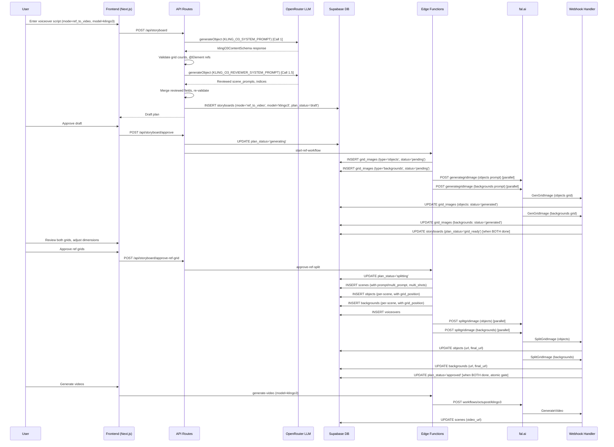

# STORYBOARD_REF_KLING_A.md — Ref-to-Video Kling O3 Pipeline Complete Documentation

## Table of Contents
1. [Overview](#overview)
2. [How It Differs From I2V](#how-it-differs-from-i2v)
3. [Architecture Diagram](#architecture-diagram)
4. [Schemas](#schemas)
5. [AI Prompts (Verbatim)](#ai-prompts-verbatim)
6. [Step-by-Step Flow](#step-by-step-flow)
7. [Database Tables & State Tracking](#database-tables--state-tracking)
8. [API Routes](#api-routes)
9. [Supabase Edge Functions](#supabase-edge-functions)
10. [Webhook Handler](#webhook-handler)
11. [Video Generation — Kling-Specific](#video-generation--kling-specific)
12. [Frontend Components](#frontend-components)
13. [Error Handling](#error-handling)

---

## Overview

The Kling O3 Ref-to-Video pipeline generates videos using reference images of characters/objects and backgrounds. Instead of a single grid image split into scene first-frames (as in I2V), this pipeline uses:

1. **Objects Grid**: A grid image of individual characters/objects on neutral backgrounds
2. **Backgrounds Grid**: A grid image of empty environment/location scenes
3. **Scene Prompts**: Cinematic prompts using `@ElementN` (for objects) and `@Image1` (for background) references
4. **Two-Pass LLM**: Content generation (Call 1) + Reviewer/fixer (Call 1.5)

The reference images are fed to the Kling O3 model at video generation time, which tracks the referenced elements across the generated video frames.

---

## How It Differs From I2V

| Aspect | I2V | Kling O3 Ref-to-Video |
|--------|-----|----------------------|
| Grid images | 1 (scene grid) | 2 (objects grid + backgrounds grid) |
| LLM calls | 1 (content only) | 2 (content + reviewer) |
| Scene prompts | `visual_flow` (animation prompts) | `scene_prompts` with `@ElementN` and `@Image1` references |
| Multi-shot | Not supported | Supported: `string | string[]` per scene |
| DB entities | scenes, first_frames, voiceovers | scenes, objects, backgrounds, voiceovers |
| Video gen input | Single outpainted image + prompt | Background image + character images + prompt |
| Video model | wan2.6, bytedance1.5pro, grok | klingo3, klingo3pro |
| Storyboard mode | null (default) | `'ref_to_video'` |
| Storyboard model | null | `'klingo3'` or `'klingo3pro'` |
| plan_status lifecycle | draft → generating → grid_ready → approved | draft → generating → grid_ready → splitting → approved |

---

## Architecture Diagram



---

## Schemas

### klingO3ContentSchema (LLM output — Call 1)

**File:** `editor/src/lib/schemas/kling-o3-plan.ts`

```typescript
const klingElementSchema = z.object({
  name: z.string(),
  description: z.string(),
});

const scenePromptItem = z.union([
  z.string(),
  z.array(z.string()).min(2).max(3),
]);

export const klingO3ContentSchema = z.object({
  objects_rows: z.number().int().min(2).max(6),
  objects_cols: z.number().int().min(2).max(6),
  objects_grid_prompt: z.string(),
  objects: z.array(klingElementSchema).min(1).max(36),

  bg_rows: z.number().int().min(2).max(6),
  bg_cols: z.number().int().min(2).max(6),
  backgrounds_grid_prompt: z.string(),
  background_names: z.array(z.string()).min(1).max(36),

  scene_prompts: z.array(scenePromptItem),
  scene_bg_indices: z.array(z.number().int().min(0)),
  scene_object_indices: z.array(z.array(z.number().int().min(0)).max(4)),

  voiceover_list: z.array(z.string()),
});
```

### klingO3PlanSchema (stored plan — after language wrapping)

```typescript
export const klingO3PlanSchema = z.object({
  // Objects grid
  objects_rows: z.number().int().min(2).max(6),
  objects_cols: z.number().int().min(2).max(6),
  objects_grid_prompt: z.string(),
  objects: z.array(klingElementSchema).min(1).max(36),

  // Backgrounds grid
  bg_rows: z.number().int().min(2).max(6),
  bg_cols: z.number().int().min(2).max(6),
  backgrounds_grid_prompt: z.string(),
  background_names: z.array(z.string()).min(1).max(36),

  // Scene mapping
  scene_prompts: z.array(scenePromptItem),
  scene_bg_indices: z.array(z.number().int().min(0)),
  scene_object_indices: z.array(z.array(z.number().int().min(0)).max(4)),

  // Voiceovers
  voiceover_list: z.record(z.string(), z.array(z.string())),
});
```

**Key difference:** `voiceover_list` is `z.array(z.string())` in content schema (flat array from LLM), but `z.record(z.string(), z.array(z.string()))` in plan schema (language-keyed after wrapping).

### klingO3ReviewerOutputSchema (LLM output — Call 1.5)

```typescript
export const klingO3ReviewerOutputSchema = z.object({
  scene_prompts: z.array(scenePromptItem),
  scene_bg_indices: z.array(z.number().int().min(0)),
  scene_object_indices: z.array(z.array(z.number().int().min(0)).max(4)),
});
```

### KlingO3Plan type

```typescript
export type KlingO3Plan = z.infer<typeof klingO3PlanSchema>;
```

---

## AI Prompts (Verbatim)

### KLING_O3_SYSTEM_PROMPT (Call 1)

**File:** `editor/src/lib/schemas/kling-o3-plan.ts`

```
You are a storyboard planner for AI video generation using Kling O3 (reference-to-video).

RULES:
1. Voiceover Splitting and Grid Planning
- Target 3-12 seconds of speech per voiceover segment.
- Adjust your splitting strategy so the total segment count matches one of the valid grid sizes below for scene count.

2. Elements (Characters/Objects)
- Each scene can use UP TO 4 tracked elements (characters/objects) + 1 background = 5 max. Try to fill all 5 objects for consistency that would avoid the random characters appearing in the video.
- Elements are reusable across scenes. Design distinct, recognizable characters/objects.
- For each element, provide:
  - "name": short label (e.g. "Ahmed", "Cat")
  - "description": detailed FULL-BODY visual description for AI tracking. For human characters, describe from HEAD TO FEET in order: face/hair, upper body clothing (style, color, neckline, sleeve length), lower body clothing (pants/skirt type, color), footwear (type, color), and accessories.
    Example: "A young boy with short brown hair, age 10, medium build, wearing a navy blue zip-up jacket over a white t-shirt, khaki cargo shorts, and gray sneakers with white soles, carrying a red backpack"
- Clothing specificity is critical for consistency. Generic descriptions like "wearing a shirt" or "casual clothes" cause the AI to generate different outfits across scenes. Always specify exact garment type, color, and style.
- Descriptions must be specific enough that the AI can consistently track the element across frames.
- Keep the same clothing for each character in ALL scenes unless the story explicitly requires a change.
- All elements must be front-facing with full body visible. Do NOT use multi-view or turnaround poses.
- Valid grid sizes for objects grid: 2x2(4), 3x2(6), 3x3(9), 4x3(12), 4x4(16), 5x4(20), 5x5(25), 6x5(30), 6x6(36).

3. Backgrounds
- Maximize background reuse: prefer fewer unique backgrounds used in many scenes over many unique backgrounds used once.
- Backgrounds represent the environment/location of each scene. They must contain NO people or characters — only the setting itself. The tracked element references will populate the scene during video generation.
- Describe backgrounds with specific atmospheric details: time of day, lighting conditions, weather, key architectural or natural features. Locations should feel lived-in (worn textures, personal objects, environmental details).
- Use varied cinematic camera angles (three-quarter view, slight low angle, wide establishing shot) — not flat straight-on views.
- Valid grid sizes for backgrounds grid: 2x2(4), 3x2(6), 3x3(9), 4x3(12), 4x4(16), 5x4(20), 5x5(25), 6x5(30), 6x6(36).

4. Scene Prompts
- Scene prompts use Kling native reference syntax:
  - @ElementN refers to the Nth element assigned to that scene (in order from scene_object_indices). @Element1 is the first object, @Element2 is the second, etc.
  - @Image1 refers to the background assigned to that scene.
- CRITICAL: Do NOT reference @ElementN where N > the number of objects in that scene's scene_object_indices.
  - Example: If scene_object_indices[i] = [0, 3], that scene has 2 objects. Use @Element1 and @Element2 ONLY. Do NOT use @Element3 or higher.
  - Example: If scene_object_indices[i] = [2], that scene has 1 object. Use @Element1 ONLY.
- CHARACTER ATTRIBUTION: When multiple characters appear in a scene, explicitly state which character performs which action. Kling confuses character-action relationships. BAD: "@Element1 and @Element2 argue, one throws a glass." GOOD: "@Element1 slams his fist on the table while @Element2 flinches and steps back."
- REFERENCE BINDING: Place @Element and @Image1 references at the specific narrative moment they appear, not just at the start. E.g., "Camera pans across @Image1, then @Element1 enters from the left and approaches @Element2 who is seated."
- FEWER REFERENCES FOR COMPLEX ACTIONS: For action-heavy scenes (running, fighting, falling), using 1-2 elements produces better motion quality than 3-4. Omit @Image1 when Kling should have creative freedom with the environment.
- DIALOGUE: When characters speak, include emotional delivery cues — tone of voice, facial expression, body language. Kling O3 generates native audio, so ambient sound cues (rain pattering, crowd murmur, footsteps echoing) improve output.

5. Multi-Shot Prompts
- When the voiceover describes multiple distinct actions, transitions, or camera changes, use an ARRAY of 2-3 shot prompts instead of a single string.
- When the voiceover describes a single continuous action or moment, use a single prompt string.
- Each shot uses @ElementN and @Image1 references.
- Shots should form a coherent visual sequence (establishing → action → reaction, or wide → medium → close-up).
- Use cinematic techniques: dolly zooms, tracking shots, rack focus, aerial reveals, close-ups, handheld feel.
- Max 3 shots per scene.

Example multi-shot prompts:
  ["Dolly zoom-in on @Element1 in @Image1, lighting shifts to blue, expression turns from worried to horrified"]
  ["Close-up of @Element1 talking on a train, natural window light, handheld camera feel, shallow depth of field", "@Element1 looks out the window as scenery passes, rack focus to reflection"]
  ["Aerial drone shot slowly revealing @Image1 at sunrise, lens flare, ultra-wide angle", "The camera descends as @Element1 walks into frame from the left", "Medium shot of @Element1 looking up at the sky in @Image1"]


6. Visual & Content Rules
DO:
- The prompts will be English but the texts and style on the image will depend on the language of the voiceover.
- Use modern islamic clothing styles if people are shown. For girls use modest clothing with NO Hijab. Modern muslim fashion styles like Turkey without religious symbols.
- If the voiceover mentions real people, brands, landmarks, or locations, use their actual names and recognizable features.
- Favor photorealistic, natural descriptions. Include subtle imperfections (weathered surfaces, natural skin texture, worn clothing details) to avoid an AI-rendered look.
- Vary camera angles across scenes — avoid repeating the same straight-on medium shot.
DO NOT:
- Do not add any extra text like a message or overlay text — no text will be seen on the grid cell.
- Do not add any violence.
- Do not describe characters with overly perfect or stylized features (no "porcelain skin", "perfectly symmetrical face", etc.).

OUTPUT FORMAT:
Return valid JSON matching this structure:
{
  "objects_rows": 3, "objects_cols": 3,
  "objects_grid_prompt": "A 3x3 Grid. Grid_1x1: A young boy with short brown hair, age 10, wearing a navy blue zip-up jacket over a white t-shirt, khaki cargo shorts, gray sneakers with white soles, carrying a red backpack, full body head to feet, on neutral white background, front-facing. Grid_1x2: A fluffy orange tabby cat with bright green eyes and a red collar with a small bell, full body showing all four paws, on neutral white background, front-facing. Grid_2x1: ..., Grid_2x2: ...",
  "objects": [
    { "name": "Ahmed", "description": "A young boy with short brown hair, age 10, medium build, wearing a navy blue zip-up jacket over a white t-shirt, khaki cargo shorts, and gray sneakers with white soles, carrying a red backpack" },
    { "name": "Cat", "description": "A fluffy orange tabby cat with bright green eyes and a red collar with a small bell" },
     ...
  ],
  "bg_rows": 2, "bg_cols": 2,
  "backgrounds_grid_prompt": "A 2x2 Grid. Grid_1x1: Three-quarter view of a city street at dusk, warm amber streetlights casting long shadows, no people. Grid_1x2: Low-angle view of a school courtyard with green trees and dappled sunlight on stone benches, no people. Grid_2x1: ..., Grid_2x2: ...",
  "background_names": ["City street at dusk", "School courtyard", "Living room", "Park"],
  "scene_prompts": [
    "@Element1 (Ahmed) walks through @Image1 while @Element2 (Cat) trots behind him, the sound of evening traffic in the background",
    ["Wide establishing shot of @Image1 as @Element1 arrives, golden hour light", "Medium shot of @Element1 kneeling down to pet @Element2 in @Image1, warm rim light on both", "Close-up of @Element1 smiling as @Element2 purrs"],
    "@Element1 sits alone in @Image1, leaning back with a tired expression, ambient hum of the room"
  ],
  "scene_bg_indices": [0, 1, 2, 0],
  "scene_object_indices": [[0, 1], [0, 1], [1], [0, 1]],
  "voiceover_list": ["segment 1 text", "segment 2 text", ...]
}
```

### KLING_O3_REVIEWER_SYSTEM_PROMPT (Call 1.5)

**File:** `editor/src/lib/schemas/kling-o3-plan.ts`

```
You are a storyboard reviewer for Kling O3 reference-to-video generation. You receive a generated storyboard plan and must fix errors and improve prompt quality.

YOUR TASKS:

1. Fix @ElementN references
   - For each scene i, check scene_object_indices[i] to know how many objects that scene has.
   - @Element1 = first object in the scene's list, @Element2 = second, etc.
   - NO @ElementN may exceed the count of objects in that scene. If scene_object_indices[i] has 2 items, only @Element1 and @Element2 are valid.
   - Fix any violations by either correcting the reference number or rewriting the prompt.

2. Fix @ImageN references
   - Only @Image1 is valid (one background per scene). Fix any @Image2, @Image3, etc.

3. Improve prompt quality
   - Background images must be empty environments with NO people or characters present.
   - Replace generic, summary-style, or executive-overview prompts with vivid, cinematic shot descriptions.
   - Include specific camera techniques: dolly zoom, tracking shot, close-up, aerial reveal, handheld feel, rack focus, push-in, crane shot, over-the-shoulder, whip pan.
   - Include lighting details: golden hour, rim light, silhouette, chiaroscuro, neon glow, natural window light, dramatic shadows.
   - Include character emotions, body language, specific actions, and movements.
   - Every prompt should read like a shot description from a professional film script.
   - Single-string prompts should describe one continuous shot. Array prompts (2-3 shots) should form a coherent visual sequence.

4. Verify character-action clarity
   - When multiple @ElementN references appear in the same prompt, each character MUST have an explicitly stated action. "They interact" is not acceptable.
   - BAD: "@Element1 and @Element2 talk" → GOOD: "@Element1 gestures animatedly while @Element2 nods and listens."
   - Add character name in parentheses after @ElementN for clarity: "@Element1 (Ahmed) hands the book to @Element2 (Sara)".

5. Check reference density
   - Scenes with @Image1 + 3-4 @Elements + complex physical actions may be over-constrained. Consider dropping @Image1 for action-heavy scenes to give Kling more creative freedom.
   - For dialogue scenes, ensure emotional delivery cues are present (facial expression, body language, tone).

6. Verify multi-shot vs single-shot
   - Use arrays of 2-3 strings for voiceover segments with multiple distinct actions, transitions, or camera changes.
   - Use a single string for continuous moments or single actions.

7. Verify scene assignments
   - Check if object/background assignments make narrative sense for each scene.
   - Reassign scene_bg_indices or scene_object_indices if needed (you can change these).
   - Ensure every scene has at least one object assigned.

DO NOT CHANGE:
- The number of scenes (array lengths must stay the same)
- Object definitions, background definitions, voiceover_list, grid dimensions
- The total set of available object indices or background indices

Return ONLY the corrected scene_prompts, scene_bg_indices, and scene_object_indices.
```

### REF_OBJECTS_GRID_PREFIX

**File:** `editor/src/lib/schemas/kling-o3-plan.ts`

```
Photorealistic cinematic style with natural skin texture. Grid image with each cell in the same size with 1px black grid lines. Each cell shows one character/object on a neutral white background, front-facing, full body visible from head to shoes, clearly separated. Each character must show their complete outfit clearly visible. Grid cells should be in the same size
```

### REF_BACKGROUNDS_GRID_PREFIX

**File:** `editor/src/lib/schemas/kling-o3-plan.ts`

```
Photorealistic cinematic style. Grid image with each cell in the same size with 1px black grid lines. Each cell shows one empty environment/location with no people, with varied cinematic camera angles (eye-level, low angle, three-quarter view, wide establishing shot). Locations should feel lived-in and atmospheric with natural lighting and environmental details. Grid cells should be in the same size
```

---

## Step-by-Step Flow

### Step 1: Plan Generation (Two-Pass LLM)

**User Action:** User enters voiceover script, selects mode = `ref_to_video`, video model = `klingo3` (or `klingo3pro`).

**API Call:** `POST /api/storyboard`

**File:** `editor/src/app/api/storyboard/route.ts` — `generateRefToVideoPlan()` function

**Request body:**
```json
{
  "voiceoverText": "...",
  "model": "google/gemini-3.1-pro-preview",
  "projectId": "uuid",
  "aspectRatio": "9:16",
  "mode": "ref_to_video",
  "videoModel": "klingo3",
  "sourceLanguage": "en"
}
```

**Valid video models:**
```typescript
const VALID_VIDEO_MODELS = ['klingo3', 'klingo3pro', 'wan26flash'] as const;
```

#### Call 1: Content Generation

```typescript
const userPrompt = `Voiceover Script:\n${voiceoverText}\n\nGenerate the storyboard.`;

const { object: content } = await generateObjectWithFallback({
  primaryModel: llmModel,
  primaryOptions: {
    plugins: [{ id: 'response-healing' }],
    ...(isOpus(llmModel) ? {} : { reasoning: { effort: 'high' } }),
  },
  system: KLING_O3_SYSTEM_PROMPT,
  prompt: userPrompt,
  schema: klingO3ContentSchema,
  label: 'ref_to_video/content',
});
```

**Validation after Call 1:**
- `objects.length` must equal `objects_rows * objects_cols`
- `background_names.length` must equal `bg_rows * bg_cols`

#### Call 1.5: Reviewer/Fixer

```typescript
const reviewerUserPrompt = `Review and improve this Kling O3 storyboard plan.

FROZEN (do not change):
- objects (${objectCount} items): ${JSON.stringify(content.objects)}
- background_names (${expectedBgs} items): ${JSON.stringify(content.background_names)}
- voiceover_list (${sceneCount} segments): ${JSON.stringify(content.voiceover_list)}

MUTABLE (fix and improve):
- scene_prompts: ${JSON.stringify(content.scene_prompts)}
- scene_bg_indices: ${JSON.stringify(content.scene_bg_indices)}
- scene_object_indices: ${JSON.stringify(content.scene_object_indices)}

Return the corrected fields.`;

const { object: reviewed } = await generateObjectWithFallback({
  primaryModel: llmModel,
  primaryOptions: {
    plugins: [{ id: 'response-healing' }],
    ...(isOpus(llmModel) ? {} : { reasoning: { effort: 'medium' } }),
  },
  system: KLING_O3_REVIEWER_SYSTEM_PROMPT,
  prompt: reviewerUserPrompt,
  schema: klingO3ReviewerOutputSchema,
  label: 'ref_to_video/reviewer',
});
```

**Note:** Reviewer uses `reasoning: { effort: 'medium' }` (vs `'high'` for content generation).

**After reviewer, fields are merged:**
```typescript
content.scene_prompts = reviewed.scene_prompts;
content.scene_bg_indices = reviewed.scene_bg_indices;
content.scene_object_indices = reviewed.scene_object_indices;
```

**Post-merge validation:**
- Scene count consistency: all arrays must have same length as `voiceover_list`
- Index bounds: `scene_bg_indices[i] < expectedBgs`, `scene_object_indices[i][j] < objectCount`
- `@ElementN` validation: For each scene, `N` must not exceed `scene_object_indices[i].length`
- `@ImageN` validation: Only `@Image1` is valid

**Final plan construction:**
```typescript
return {
  objects_rows: klingContent.objects_rows,
  objects_cols: klingContent.objects_cols,
  objects_grid_prompt: `${REF_OBJECTS_GRID_PREFIX} ${klingContent.objects_grid_prompt}`,
  objects: klingContent.objects,
  bg_rows: klingContent.bg_rows,
  bg_cols: klingContent.bg_cols,
  backgrounds_grid_prompt: `${REF_BACKGROUNDS_GRID_PREFIX} ${klingContent.backgrounds_grid_prompt}`,
  background_names: klingContent.background_names,
  scene_prompts: klingContent.scene_prompts,
  scene_bg_indices: klingContent.scene_bg_indices,
  scene_object_indices: klingContent.scene_object_indices,
  voiceover_list: { [sourceLanguage]: content.voiceover_list },
};
```

**Database insert:**
```typescript
await supabase.from('storyboards').insert({
  project_id: projectId,
  voiceover: voiceoverText,
  aspect_ratio: aspectRatio,
  plan: finalPlan,
  plan_status: 'draft',
  mode: 'ref_to_video',
  model: videoModel,  // 'klingo3' or 'klingo3pro'
});
```

### Step 2: Approve Draft → Generate Grid Images

**API Call:** `POST /api/storyboard/approve`

**File:** `editor/src/app/api/storyboard/approve/route.ts`

For ref_to_video mode, the approve route calls `start-ref-workflow` (not `start-workflow`):
```typescript
const isRefMode = storyboard.mode === 'ref_to_video';
const edgeFunctionName = isRefMode ? 'start-ref-workflow' : 'start-workflow';
```

**Body sent to start-ref-workflow:**
```json
{
  "storyboard_id": "uuid",
  "project_id": "uuid",
  "objects_rows": 3,
  "objects_cols": 3,
  "objects_grid_prompt": "Photorealistic cinematic style...",
  "object_names": ["Ahmed", "Cat", ...],
  "bg_rows": 2,
  "bg_cols": 2,
  "backgrounds_grid_prompt": "Photorealistic cinematic style...",
  "background_names": ["City street", ...],
  "scene_prompts": [...],
  "scene_bg_indices": [...],
  "scene_object_indices": [...],
  "voiceover_list": { "en": [...] },
  "width": 1080,
  "height": 1920,
  "voiceover": "full script",
  "aspect_ratio": "9:16"
}
```

### Step 3: start-ref-workflow Edge Function

**File:** `supabase/functions/start-ref-workflow/index.ts`

**Process:**
1. Validates input (grid dimensions 2-6, array lengths match, voiceover_list has at least one language)
2. Creates TWO `grid_images` records:
   ```typescript
   // Objects grid
   await supabase.from('grid_images').insert({
     storyboard_id,
     prompt: objects_grid_prompt,
     status: 'pending',
     type: 'objects',
     detected_rows: objects_rows,
     detected_cols: objects_cols,
     dimension_detection_status: 'success',
   });

   // Backgrounds grid
   await supabase.from('grid_images').insert({
     storyboard_id,
     prompt: backgrounds_grid_prompt,
     status: 'pending',
     type: 'backgrounds',
     detected_rows: bg_rows,
     detected_cols: bg_cols,
     dimension_detection_status: 'success',
   });
   ```
3. Sends TWO parallel fal.ai requests:
   ```typescript
   const [objectsResult, bgResult] = await Promise.all([
     sendFalGridRequest(objects_grid_prompt, objectsWebhookUrl, log),
     sendFalGridRequest(backgrounds_grid_prompt, bgWebhookUrl, log),
   ]);
   ```
   Both use endpoint: `https://queue.fal.run/workflows/octupost/generategridimage`
   Both use webhook step: `GenGridImage`

### Step 4: Webhook — GenGridImage (Ref-to-Video)

**File:** `supabase/functions/webhook/index.ts` — `handleGenGridImage()`

For `ref_to_video` mode, the `grid_ready` status is only set when **ALL** grids are done:

```typescript
if (storyboard?.mode === 'ref_to_video') {
  const { data: pendingGrids } = await supabase
    .from('grid_images')
    .select('id')
    .eq('storyboard_id', storyboard_id)
    .in('status', ['pending', 'processing']);

  if (!pendingGrids || pendingGrids.length === 0) {
    // All grids done — check if any failed
    const { data: failedGrids } = await supabase
      .from('grid_images')
      .select('id')
      .eq('storyboard_id', storyboard_id)
      .eq('status', 'failed');

    if (failedGrids && failedGrids.length > 0) {
      // Set storyboard to failed
      await supabase.from('storyboards')
        .update({ plan_status: 'failed' })
        .eq('id', storyboard_id)
        .eq('plan_status', 'generating');
    } else {
      // All success — set grid_ready
      await supabase.from('storyboards')
        .update({ plan_status: 'grid_ready' })
        .eq('id', storyboard_id)
        .eq('plan_status', 'generating');
    }
  }
}
```

### Step 5: Approve Ref Grids → Split

**Frontend:** `ref-grid-image-review.tsx` — Shows both objects and backgrounds grids side by side.

**API Call:** `POST /api/storyboard/approve-ref-grid`

**File:** `editor/src/app/api/storyboard/approve-ref-grid/route.ts`

**Request body:**
```json
{
  "storyboardId": "uuid",
  "objectsRows": 3,
  "objectsCols": 3,
  "bgRows": 2,
  "bgCols": 2
}
```

**Validations:**
- All dimensions must be integers between 2 and 6
- Grid constraint: rows must equal cols or cols + 1
- `plan_status === 'grid_ready'`
- `mode === 'ref_to_video'`
- Both grid images must exist with URLs

**If dimensions changed:**
- Adjusts `objects` array (truncate or pad with `{ name: "Object N", description: "" }`)
- Adjusts `object_names` for legacy plans
- Filters `scene_object_indices` to remove indices >= new object count
- Adjusts `background_names` (truncate or pad with `"Background N"`)
- Clamps `scene_bg_indices` to valid range: `Math.min(idx, newBgCount - 1)`

**Body sent to approve-ref-split:**
```json
{
  "storyboard_id": "uuid",
  "objects_grid_image_id": "uuid",
  "objects_grid_image_url": "...",
  "objects_rows": 3,
  "objects_cols": 3,
  "bg_grid_image_id": "uuid",
  "bg_grid_image_url": "...",
  "bg_rows": 2,
  "bg_cols": 2,
  "object_names": ["Ahmed", "Cat", ...],
  "object_descriptions": ["A young boy...", "A fluffy..."],
  "background_names": ["City street", ...],
  "scene_prompts": [...],
  "scene_bg_indices": [...],
  "scene_object_indices": [...],
  "voiceover_list": { "en": [...] },
  "width": 1080,
  "height": 1920
}
```

### Step 6: approve-ref-split Edge Function

**File:** `supabase/functions/approve-ref-split/index.ts`

**Process:**

1. Sets `plan_status = 'splitting'`

2. Creates scenes with prompts:
   ```typescript
   for (let i = 0; i < sceneCount; i++) {
     await supabase.from('scenes').insert({
       storyboard_id,
       order: i,
       prompt: Array.isArray(scene_prompts[i]) ? null : scene_prompts[i],
       multi_prompt: Array.isArray(scene_prompts[i]) ? scene_prompts[i] : null,
       multi_shots: scene_multi_shots?.[i] ?? null,
     });
   }
   ```

3. Creates voiceovers for each language per scene

4. Creates objects per scene (with `grid_position` for later image mapping):
   ```typescript
   for (let sceneIdx = 0; sceneIdx < sceneIds.length; sceneIdx++) {
     const objectIndices = scene_object_indices[sceneIdx] || [];
     for (let pos = 0; pos < objectIndices.length; pos++) {
       const gridPos = objectIndices[pos];
       await supabase.from('objects').insert({
         grid_image_id: objects_grid_image_id,
         scene_id: sceneIds[sceneIdx],
         scene_order: pos,
         grid_position: gridPos,
         name: object_names[gridPos],
         description: object_descriptions?.[gridPos] ?? null,
         status: 'processing',
       });
     }
   }
   ```

5. Creates backgrounds per scene:
   ```typescript
   for (let sceneIdx = 0; sceneIdx < sceneIds.length; sceneIdx++) {
     const bgIndex = scene_bg_indices[sceneIdx];
     await supabase.from('backgrounds').insert({
       grid_image_id: bg_grid_image_id,
       scene_id: sceneIds[sceneIdx],
       grid_position: bgIndex,
       name: background_names[bgIndex],
       status: 'processing',
     });
   }
   ```

6. Sends TWO parallel split requests:
   ```typescript
   const [objectsSplit, bgSplit] = await Promise.all([
     sendSplitRequest(objects_grid_image_url, objects_grid_image_id, ...),
     sendSplitRequest(bg_grid_image_url, bg_grid_image_id, ...),
   ]);
   ```
   Both use: `POST https://queue.fal.run/comfy/octupost/splitgridimage`
   Body: `{ loadimage_1: url, rows, cols, width, height }`
   Webhook: `step=SplitGridImage&grid_image_id=...&storyboard_id=...`

### Step 7: Webhook — SplitGridImage (Objects & Backgrounds)

**File:** `supabase/functions/webhook/index.ts` — `handleSplitGridImage()`

The handler routes based on `grid_images.type`:
- `'objects'` → `handleObjectsSplit()`
- `'backgrounds'` → `handleBackgroundsSplit()`
- default (no type) → `handleSceneSplit()` (I2V path)

#### handleObjectsSplit

Updates all `objects` rows matching `(grid_image_id, grid_position)`:
```typescript
for (let i = 0; i < urlImages.length; i++) {
  await supabase.from('objects').update({
    url: urlImages[i]?.url || null,
    final_url: urlImages[i]?.url || null,
    status: imageUrl ? 'success' : 'failed',
  })
  .eq('grid_image_id', grid_image_id)
  .eq('grid_position', i);
}
```

This updates **all sibling objects** across scenes that share the same `grid_position`.

#### handleBackgroundsSplit

Same pattern for backgrounds:
```typescript
for (let i = 0; i < urlImages.length; i++) {
  await supabase.from('backgrounds').update({
    url: urlImages[i]?.url || null,
    final_url: urlImages[i]?.url || null,
    status: imageUrl ? 'success' : 'failed',
  })
  .eq('grid_image_id', grid_image_id)
  .eq('grid_position', i);
}
```

#### tryCompleteSplitting (Atomic Gate)

After each split completes, checks if both are done:
```typescript
async function tryCompleteSplitting(supabase, storyboard_id, log) {
  // Check if any objects or backgrounds are still not success
  const { data: pendingObjects } = await supabase
    .from('objects').select('id')
    .eq('grid_image_id', objectsGridId)
    .neq('status', 'success');

  const { data: pendingBackgrounds } = await supabase
    .from('backgrounds').select('id')
    .eq('grid_image_id', backgroundsGridId)
    .neq('status', 'success');

  if (pendingObjects.length > 0 || pendingBackgrounds.length > 0) return;

  // Atomic gate: only one webhook wins
  const { data: claimed } = await supabase
    .from('storyboards')
    .update({ plan_status: 'approved' })
    .eq('id', storyboard_id)
    .eq('plan_status', 'splitting')
    .select('id');
}
```

This prevents race conditions — only one of the two webhook calls will successfully transition from `'splitting'` to `'approved'`.

---

## Database Tables & State Tracking

### Additional tables for Kling O3 (beyond I2V tables)

### `objects` table
| Column | Type | Description |
|--------|------|-------------|
| id | uuid | Primary key |
| grid_image_id | uuid | FK to grid_images (objects grid) |
| scene_id | uuid | FK to scenes |
| scene_order | int | Position within scene's object list (0-indexed) |
| grid_position | int | Position in the grid (0-indexed, maps to split image index) |
| name | text | Element name (e.g., "Ahmed") |
| description | text | Detailed visual description (Kling only) |
| status | text | processing → success / failed |
| url | text | Split image URL |
| final_url | text | Current best image URL |
| image_edit_status | text | null / enhancing / editing / success / failed |
| image_edit_request_id | text | fal.ai request ID |
| image_edit_error_message | text | Error details |

### `backgrounds` table
| Column | Type | Description |
|--------|------|-------------|
| id | uuid | Primary key |
| grid_image_id | uuid | FK to grid_images (backgrounds grid) |
| scene_id | uuid | FK to scenes |
| grid_position | int | Position in the grid |
| name | text | Background name |
| status | text | processing → success / failed |
| url | text | Split image URL |
| final_url | text | Current best image URL |
| image_edit_status | text | null / enhancing / editing / success / failed |

### `scenes` table (additional columns for ref-to-video)
| Column | Type | Description |
|--------|------|-------------|
| prompt | text | Single scene prompt (or null for multi-shot) |
| multi_prompt | jsonb | Array of shot prompts (or null for single) |
| multi_shots | boolean | Whether this scene uses multi-shot rendering |

### `grid_images` table (type field)
| Column | Type | Description |
|--------|------|-------------|
| type | text | `'objects'` or `'backgrounds'` (null for I2V) |

### plan_status lifecycle (Kling O3)
```
draft → generating → grid_ready → splitting → approved
                  ↘ failed     ↘ failed
```

---

## Video Generation — Kling-Specific

### Model Configuration

**File:** `supabase/functions/generate-video/index.ts`

```typescript
klingo3: {
  endpoint: 'workflows/octupost/klingo3',
  mode: 'ref_to_video',
  validResolutions: ['720p', '1080p'],
  bucketDuration: (raw) => Math.max(3, Math.min(15, raw)),
  buildPayload: ({
    prompt, elements, image_urls, duration, aspect_ratio, multi_prompt, multi_shots,
  }) => ({
    prompt: multi_prompt && multi_prompt.length > 0 ? '' : prompt,
    multi_prompt: multi_prompt && multi_prompt.length > 0
      ? splitMultiPromptDurations(multi_prompt, Number(duration))
      : [],
    elements: elements || [],
    image_urls: image_urls || [],
    duration: String(duration),
    aspect_ratio: aspect_ratio ?? '16:9',
    multi_shots: multi_shots ?? false,
  }),
},
klingo3pro: {
  endpoint: 'workflows/octupost/klingo3pro',
  // ... identical config to klingo3
},
```

### splitMultiPromptDurations

When multi-shot prompts are used, each shot gets a calculated duration:
```typescript
function splitMultiPromptDurations(
  prompts: string[],
  totalDuration: number
): { prompt: string; duration: string }[] {
  const count = prompts.length;
  const base = Math.floor(totalDuration / count);
  const remainder = totalDuration - base * count;

  return prompts.map((p, i) => {
    const shotDuration = Math.max(3, Math.min(15, base + (i < remainder ? 1 : 0)));
    return { prompt: p, duration: String(shotDuration) };
  });
}
```

### Ref Video Context Building

**Function:** `getRefVideoContext()` in `generate-video/index.ts`

1. Fetches scene with `prompt`, `multi_prompt`, `multi_shots`, `voiceovers`
2. Fetches objects by `scene_id` ordered by `scene_order` → extracts `final_url` for each
3. Fetches background by `scene_id` → extracts `final_url`
4. Validates: max 4 objects for Kling O3
5. Detects multi-shot: prefers `multi_prompt` column, falls back to JSON-parsed `prompt` column
6. No prompt resolution needed — Kling O3 uses `@ElementN`/`@Image1` natively

### Payload Construction for Kling O3

```typescript
if (model === 'klingo3' || model === 'klingo3pro') {
  // Build elements from object URLs
  const elements = context.object_urls.map((url) => ({
    frontal_image_url: url,
    reference_image_urls: [url],
  }));

  payload = modelConfig.buildPayload({
    prompt: context.prompt,
    image_url: '',
    resolution,
    elements,                         // Array of { frontal_image_url, reference_image_urls }
    image_urls: [context.background_url],  // Background as image_urls[0]
    duration: context.duration,
    aspect_ratio,
    multi_prompt: context.multi_prompt,
    multi_shots: context.multi_shots,
  });
}
```

**Final payload sent to fal.ai:**
```json
{
  "prompt": "scene prompt with @Element1 @Image1...",
  "multi_prompt": [],
  "elements": [
    {
      "frontal_image_url": "object1_url",
      "reference_image_urls": ["object1_url"]
    },
    {
      "frontal_image_url": "object2_url",
      "reference_image_urls": ["object2_url"]
    }
  ],
  "image_urls": ["background_url"],
  "duration": "10",
  "aspect_ratio": "9:16",
  "multi_shots": false
}
```

**Or with multi-shot prompts:**
```json
{
  "prompt": "",
  "multi_prompt": [
    { "prompt": "Shot 1 text...", "duration": "5" },
    { "prompt": "Shot 2 text...", "duration": "5" }
  ],
  "elements": [...],
  "image_urls": ["background_url"],
  "duration": "10",
  "aspect_ratio": "9:16",
  "multi_shots": true
}
```

### Kling Reference Syntax Summary

| Reference | Meaning |
|-----------|---------|
| `@Element1` | First object in `scene_object_indices[i]` |
| `@Element2` | Second object in `scene_object_indices[i]` |
| `@Element3` | Third object (max 4) |
| `@Element4` | Fourth object (max 4) |
| `@Image1` | Background from `scene_bg_indices[i]` |

**Constraint:** `@ElementN` where `N <= scene_object_indices[i].length`. Only `@Image1` is valid (no `@Image2+`).

---

## Frontend Components

### ref-grid-image-review.tsx
- **File:** `editor/src/components/editor/media-panel/panel/ref-grid-image-review.tsx`
- Shows both objects grid and backgrounds grid side by side
- Allows rows/cols adjustment for each grid independently
- Approve button calls `/api/storyboard/approve-ref-grid`

### draft-plan-editor.tsx (Ref mode)
- **File:** `editor/src/components/editor/media-panel/panel/draft-plan-editor.tsx`
- For ref plans, shows:
  - `objects_grid_prompt` (editable)
  - `backgrounds_grid_prompt` (editable)
  - Objects list (name + description, editable)
  - Background names (editable)
  - Scene prompts with `@Element` references (editable)
  - Scene object/background assignments
- For Kling specifically: scene_prompts support `string | string[]` (multi-shot arrays)

### storyboard-cards.tsx (Ref mode additions)
- **File:** `editor/src/components/editor/media-panel/panel/storyboard-cards.tsx`
- Additional actions for ref-to-video: enhance/edit objects and backgrounds
- Object editing calls `edit-image` with `source: 'object'` and `object_ids`
- Background editing calls `edit-image` with `source: 'background'`

---

## Error Handling

### Two-Pass LLM Errors
- If Call 1 fails: automatic retry with backup model `stepfun/step-3.5-flash:free`
- If grid count mismatch after Call 1: throws error (reviewer cannot fix grid counts)
- If Call 1.5 (reviewer) fails: automatic retry with backup model
- Post-reviewer validation: scene count mismatch, index out of bounds, invalid `@ElementN` references all throw errors

### Grid Generation (ref_to_video)
- If both fal.ai requests fail: `plan_status` set to `'failed'`
- If one fails: the failed grid is marked, but storyboard continues. When the remaining grid completes, the webhook checks for failed siblings and sets `plan_status` to `'failed'` if any grid failed

### Split Race Condition
- `tryCompleteSplitting()` uses an atomic `UPDATE ... WHERE plan_status = 'splitting'` to prevent both webhook handlers from transitioning to `'approved'`
- Only one handler wins the race

### Video Generation Limits
- Kling O3: max 4 elements per scene (validated in `getRefVideoContext`)
- If exceeded: scene is skipped with error
