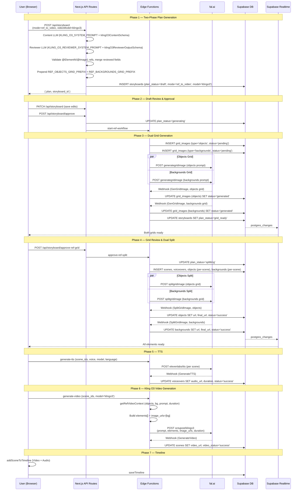

# STORYBOARD_REF_KLING_B — Ref-to-Video Kling O3 Pipeline

## 1. Overview

The Kling O3 Ref-to-Video pipeline generates videos using tracked character/object references and background images. Instead of a single grid with one first-frame per scene, it generates **two grids**: an objects grid (characters/objects with white backgrounds) and a backgrounds grid (empty environments). These are split into individual images, then Kling O3 composites them into video using `@ElementN` (objects) and `@Image1` (background) native reference syntax.

The LLM plan goes through a **two-phase review**: a Content LLM generates the full plan, then a Reviewer LLM fixes `@ElementN`/`@Image1` references and improves prompt quality. This ensures reference correctness before any generation begins.

**Key Differences from I2V:**
- Two grids instead of one (objects + backgrounds)
- Scene prompts reference tracked elements (`@ElementN`) and background (`@Image1`)
- Multi-shot prompts (2-3 shot arrays) for complex scenes
- Kling O3 builds `elements[]` array with `frontal_image_url` + `reference_image_urls`
- No `first_frames` table — uses `objects` + `backgrounds` tables instead
- Two-phase LLM (content + reviewer)
- `plan_status='splitting'` state during ref grid split

---

## 2. User Journey

1. **Create**: User enters voiceover script, selects aspect ratio, AI model, video mode = "Ref", video model = "Kling O3", and source language.
2. **Generate Plan**: Click "Generate" → `POST /api/storyboard` (mode=`ref_to_video`, videoModel=`klingo3`) → Two LLM calls (content + reviewer) produce a draft plan. UI switches to **draft view**.
3. **Review Draft**: User edits in `DraftPlanEditor`:
   - Objects grid prompt, backgrounds grid prompt
   - Objects list (name + description per element)
   - Backgrounds list
   - Scene prompts with `@ElementN`/`@Image1` reference badges
   - Scene-to-object and scene-to-background assignments
4. **Approve Draft**: Click "Generate Grids" → `POST /api/storyboard/approve` → sets `plan_status='generating'` → calls `start-ref-workflow` → fal.ai generates **both** grid images in parallel.
5. **Review Grids**: Webhook sets `plan_status='grid_ready'` when both grids are done. User sees `RefGridImageReview` with separate dimension editors for objects (2-6) and backgrounds (2-6).
6. **Approve Grids**: Click "Approve" → `POST /api/storyboard/approve-ref-grid` → calls `approve-ref-split` → creates scenes, objects, backgrounds, voiceovers → sends two parallel split requests. Sets `plan_status='splitting'`.
7. **Split Completes**: Webhook distributes split images to `objects` and `backgrounds` records per scene. Each scene now has its tracked elements and background.
8. **Image Editing** (optional): User can enhance/custom-edit objects, swap backgrounds.
9. **Generate Voiceovers**: Same as I2V — `generate-tts` edge function.
10. **Generate Videos**: User selects model `klingo3` → `generate-video` edge function builds Kling payload with `elements[]` and `image_urls=[bg]`.
11. **Add to Timeline**: Same as I2V — `addSceneToTimeline()`.

---

## 3. Technical Flow

### 3.1 Plan Generation (Two-Phase LLM)

```
UI (storyboard.tsx) handleGenerate()
  → POST /api/storyboard (mode='ref_to_video', videoModel='klingo3')
    → generateRefToVideoPlan(voiceoverText, llmModel, 'klingo3', sourceLanguage)

Phase 1 — Content LLM:
  → generateObjectWithFallback({
      primaryModel: user-selected model,
      primaryOptions: { plugins: ['response-healing'], reasoning: { effort: 'high' } },
      schema: klingO3ContentSchema,
      system: KLING_O3_SYSTEM_PROMPT,
      prompt: "Voiceover Script:\n{text}\n\nGenerate the storyboard."
    })
  → Validates: objects.length == objects_rows * objects_cols
  → Validates: background_names.length == bg_rows * bg_cols

Phase 2 — Reviewer LLM:
  → generateObjectWithFallback({
      primaryModel: same model,
      primaryOptions: { plugins: ['response-healing'], reasoning: { effort: 'medium' } },
      schema: klingO3ReviewerOutputSchema,
      system: KLING_O3_REVIEWER_SYSTEM_PROMPT,
      prompt: reviewerUserPrompt (frozen context + mutable fields)
    })
  → Merges reviewed: scene_prompts, scene_bg_indices, scene_object_indices

Post-review validation:
  → Scene count consistency across all arrays
  → Index bounds: scene_bg_indices[i] < expectedBgs, scene_object_indices[i][j] < objectCount
  → @ElementN validation: for each scene, N must not exceed scene_object_indices[i].length
  → @ImageN validation: only @Image1 allowed (one background per scene)

Final plan construction:
  → Prepends REF_OBJECTS_GRID_PREFIX to objects_grid_prompt
  → Prepends REF_BACKGROUNDS_GRID_PREFIX to backgrounds_grid_prompt
  → Wraps voiceover_list: { [sourceLanguage]: content.voiceover_list }
  → INSERT storyboards: plan_status='draft', mode='ref_to_video', model='klingo3'
```

### 3.2 Reviewer User Prompt (constructed dynamically)

```
Review and improve this Kling O3 storyboard plan.

FROZEN (do not change):
- objects ({objectCount} items): {JSON.stringify(content.objects)}
- background_names ({expectedBgs} items): {JSON.stringify(content.background_names)}
- voiceover_list ({sceneCount} segments): {JSON.stringify(content.voiceover_list)}

MUTABLE (fix and improve):
- scene_prompts: {JSON.stringify(content.scene_prompts)}
- scene_bg_indices: {JSON.stringify(content.scene_bg_indices)}
- scene_object_indices: {JSON.stringify(content.scene_object_indices)}

Return the corrected fields.
```

### 3.3 Draft Approval → Grid Generation

```
POST /api/storyboard/approve
  → Validates plan_status == 'draft'
  → UPDATE storyboards SET plan_status='generating'
  → Builds body for start-ref-workflow:
    { storyboard_id, project_id, objects_rows, objects_cols, objects_grid_prompt,
      object_names (from plan.objects[].name), bg_rows, bg_cols, backgrounds_grid_prompt,
      background_names, scene_prompts, scene_bg_indices, scene_object_indices,
      voiceover_list, width, height, voiceover, aspect_ratio }
  → fetch(`${supabaseUrl}/functions/v1/start-ref-workflow`, ...)
  → On failure: reverts plan_status to 'draft'

start-ref-workflow edge function:
  → INSERT grid_images (type='objects'): status='pending', detected_rows=objects_rows, detected_cols=objects_cols
  → INSERT grid_images (type='backgrounds'): status='pending', detected_rows=bg_rows, detected_cols=bg_cols
  → Build two webhook URLs (both step=GenGridImage, different grid_image_ids)
  → Promise.all([
      sendFalGridRequest(objects_grid_prompt, objectsWebhookUrl),
      sendFalGridRequest(backgrounds_grid_prompt, bgWebhookUrl)
    ])
  → POST https://queue.fal.run/workflows/octupost/generategridimage for each
  → Update grid_images to status='processing' with request_ids
  → If both fail: UPDATE storyboards SET plan_status='failed'
```

### 3.4 Grid Webhook → grid_ready

```
fal.ai callback → webhook?step=GenGridImage&grid_image_id=...&storyboard_id=...
  → UPDATE grid_images SET url=..., status='generated'
  → Check: are ALL grid_images for this storyboard generated?
    (Both objects and backgrounds grids must be 'generated')
  → If all ready: UPDATE storyboards SET plan_status='grid_ready'
```

### 3.5 Grid Approval → Ref Split

```
POST /api/storyboard/approve-ref-grid
  → Validates plan_status == 'grid_ready', mode == 'ref_to_video'
  → Fetches both grid images (type='objects' and type='backgrounds')
  → If dimensions changed:
    - Adjusts plan.objects array (truncate or add placeholders)
    - Filters scene_object_indices to remove out-of-range indices
    - Adjusts plan.background_names (truncate or add placeholders)
    - Clamps scene_bg_indices to valid range
    - Persists updated plan to DB
  → Builds object_names from plan.objects[].name
  → Builds object_descriptions from plan.objects[].description
  → fetch(`${supabaseUrl}/functions/v1/approve-ref-split`, {
      body: { storyboard_id, objects_grid_image_id, objects_grid_image_url,
              objects_rows, objects_cols, bg_grid_image_id, bg_grid_image_url,
              bg_rows, bg_cols, object_names, object_descriptions, background_names,
              scene_prompts, scene_bg_indices, scene_object_indices,
              voiceover_list, width, height }
    })

approve-ref-split edge function:
  → UPDATE storyboards SET plan_status='splitting'
  → For each scene (i in 0..sceneCount):
    → INSERT scenes: { storyboard_id, order: i,
        prompt: (string prompt or null), multi_prompt: (array or null) }
    → For each language: INSERT voiceovers: { scene_id, text, language, status:'success' }
  → For each scene, for each object index in scene_object_indices[i]:
    → INSERT objects: { grid_image_id: objects_grid_image_id, scene_id, scene_order: pos,
        grid_position: objectIndex, name, description, status:'processing' }
  → For each scene:
    → INSERT backgrounds: { grid_image_id: bg_grid_image_id, scene_id,
        grid_position: bgIndex, name, status:'processing' }
  → Promise.all([
      sendSplitRequest(objects_grid_image_url, objects_grid_image_id, ...),
      sendSplitRequest(bg_grid_image_url, bg_grid_image_id, ...)
    ])
  → Each: POST https://queue.fal.run/comfy/octupost/splitgridimage
    body: { loadimage_1, rows, cols, width, height }
```

### 3.6 Split Webhook (Ref)

```
fal.ai callback → webhook?step=SplitGridImage&grid_image_id=...
  → For objects grid: distributes split images to objects records
    matching grid_image_id and grid_position
    → UPDATE objects SET url=..., final_url=..., status='success'
    (Updates ALL objects with same grid_image_id + grid_position — siblings across scenes)
  → For backgrounds grid: distributes to backgrounds records
    → UPDATE backgrounds SET url=..., final_url=..., status='success'
```

### 3.7 Video Generation (Kling O3)

```
generate-video edge function (ref_to_video path):
  → getRefVideoContext(supabase, sceneId, 'klingo3', bucketDuration):
    → Fetches scene.prompt, scene.multi_prompt, scene.video_status
    → Fetches objects by scene_id ordered by scene_order → objectUrls[]
    → Fetches background by scene_id → background_url
    → Validates: objectCount <= 4 for klingo3
    → Duration: max voiceover duration → Math.ceil → bucketDuration(3-15)
    → If multi_prompt exists: resolveMultiPrompt (no-op for Kling, already uses native syntax)
    → If single prompt: resolvePrompt (no-op for Kling)
  → sendRefVideoRequest:
    → Builds elements array: objectUrls.map(url => ({
        frontal_image_url: url, reference_image_urls: [url]
      }))
    → Calls modelConfig.buildPayload:
      - If multi_prompt: prompt='', multi_prompt=splitMultiPromptDurations(shots, duration)
      - If single: prompt=resolved, multi_prompt=[]
      - elements=elements, image_urls=[background_url], duration, aspect_ratio
    → POST https://queue.fal.run/workflows/octupost/klingo3?fal_webhook=...
```

### Kling O3 Payload Structure

```json
{
  "prompt": "<scene prompt with @ElementN/@Image1, or empty if multi_prompt>",
  "multi_prompt": [
    { "prompt": "<shot 1>", "duration": "5" },
    { "prompt": "<shot 2>", "duration": "5" }
  ],
  "elements": [
    { "frontal_image_url": "<object1_url>", "reference_image_urls": ["<object1_url>"] },
    { "frontal_image_url": "<object2_url>", "reference_image_urls": ["<object2_url>"] }
  ],
  "image_urls": ["<background_url>"],
  "duration": "10",
  "aspect_ratio": "9:16",
  "multi_shots": false
}
```

### splitMultiPromptDurations

```typescript
function splitMultiPromptDurations(prompts: string[], totalDuration: number) {
  const count = prompts.length;
  const base = Math.floor(totalDuration / count);
  const remainder = totalDuration - base * count;
  return prompts.map((p, i) => ({
    prompt: p,
    duration: String(Math.max(3, Math.min(15, base + (i < remainder ? 1 : 0))))
  }));
}
```

---

## 4. AI Prompts (Verbatim)

### KLING_O3_SYSTEM_PROMPT

```
You are a storyboard planner for AI video generation using Kling O3 (reference-to-video).

RULES:
1. Voiceover Splitting and Grid Planning
- Target 3-12 seconds of speech per voiceover segment.
- Adjust your splitting strategy so the total segment count matches one of the valid grid sizes below for scene count.

2. Elements (Characters/Objects)
- Each scene can use UP TO 4 tracked elements (characters/objects) + 1 background = 5 max. Try to fill all 5 objects for consistency that would avoid the random characters appearing in the video.
- Elements are reusable across scenes. Design distinct, recognizable characters/objects.
- For each element, provide:
  - "name": short label (e.g. "Ahmed", "Cat")
  - "description": detailed FULL-BODY visual description for AI tracking. For human characters, describe from HEAD TO FEET in order: face/hair, upper body clothing (style, color, neckline, sleeve length), lower body clothing (pants/skirt type, color), footwear (type, color), and accessories.
    Example: "A young boy with short brown hair, age 10, medium build, wearing a navy blue zip-up jacket over a white t-shirt, khaki cargo shorts, and gray sneakers with white soles, carrying a red backpack"
- Clothing specificity is critical for consistency. Generic descriptions like "wearing a shirt" or "casual clothes" cause the AI to generate different outfits across scenes. Always specify exact garment type, color, and style.
- Descriptions must be specific enough that the AI can consistently track the element across frames.
- Keep the same clothing for each character in ALL scenes unless the story explicitly requires a change.
- All elements must be front-facing with full body visible. Do NOT use multi-view or turnaround poses.
- Valid grid sizes for objects grid: 2x2(4), 3x2(6), 3x3(9), 4x3(12), 4x4(16), 5x4(20), 5x5(25), 6x5(30), 6x6(36).

3. Backgrounds
- Maximize background reuse: prefer fewer unique backgrounds used in many scenes over many unique backgrounds used once.
- Backgrounds represent the environment/location of each scene. They must contain NO people or characters — only the setting itself. The tracked element references will populate the scene during video generation.
- Describe backgrounds with specific atmospheric details: time of day, lighting conditions, weather, key architectural or natural features. Locations should feel lived-in (worn textures, personal objects, environmental details).
- Use varied cinematic camera angles (three-quarter view, slight low angle, wide establishing shot) — not flat straight-on views.
- Valid grid sizes for backgrounds grid: 2x2(4), 3x2(6), 3x3(9), 4x3(12), 4x4(16), 5x4(20), 5x5(25), 6x5(30), 6x6(36).

4. Scene Prompts
- Scene prompts use Kling native reference syntax:
  - @ElementN refers to the Nth element assigned to that scene (in order from scene_object_indices). @Element1 is the first object, @Element2 is the second, etc.
  - @Image1 refers to the background assigned to that scene.
- CRITICAL: Do NOT reference @ElementN where N > the number of objects in that scene's scene_object_indices.
  - Example: If scene_object_indices[i] = [0, 3], that scene has 2 objects. Use @Element1 and @Element2 ONLY. Do NOT use @Element3 or higher.
  - Example: If scene_object_indices[i] = [2], that scene has 1 object. Use @Element1 ONLY.
- CHARACTER ATTRIBUTION: When multiple characters appear in a scene, explicitly state which character performs which action. Kling confuses character-action relationships. BAD: "@Element1 and @Element2 argue, one throws a glass." GOOD: "@Element1 slams his fist on the table while @Element2 flinches and steps back."
- REFERENCE BINDING: Place @Element and @Image1 references at the specific narrative moment they appear, not just at the start. E.g., "Camera pans across @Image1, then @Element1 enters from the left and approaches @Element2 who is seated."
- FEWER REFERENCES FOR COMPLEX ACTIONS: For action-heavy scenes (running, fighting, falling), using 1-2 elements produces better motion quality than 3-4. Omit @Image1 when Kling should have creative freedom with the environment.
- DIALOGUE: When characters speak, include emotional delivery cues — tone of voice, facial expression, body language. Kling O3 generates native audio, so ambient sound cues (rain pattering, crowd murmur, footsteps echoing) improve output.

5. Multi-Shot Prompts
- When the voiceover describes multiple distinct actions, transitions, or camera changes, use an ARRAY of 2-3 shot prompts instead of a single string.
- When the voiceover describes a single continuous action or moment, use a single prompt string.
- Each shot uses @ElementN and @Image1 references.
- Shots should form a coherent visual sequence (establishing → action → reaction, or wide → medium → close-up).
- Use cinematic techniques: dolly zooms, tracking shots, rack focus, aerial reveals, close-ups, handheld feel.
- Max 3 shots per scene.

Example multi-shot prompts:
  ["Dolly zoom-in on @Element1 in @Image1, lighting shifts to blue, expression turns from worried to horrified"]
  ["Close-up of @Element1 talking on a train, natural window light, handheld camera feel, shallow depth of field", "@Element1 looks out the window as scenery passes, rack focus to reflection"]
  ["Aerial drone shot slowly revealing @Image1 at sunrise, lens flare, ultra-wide angle", "The camera descends as @Element1 walks into frame from the left", "Medium shot of @Element1 looking up at the sky in @Image1"]


6. Visual & Content Rules
DO:
- The prompts will be English but the texts and style on the image will depend on the language of the voiceover.
- Use modern islamic clothing styles if people are shown. For girls use modest clothing with NO Hijab. Modern muslim fashion styles like Turkey without religious symbols.
- If the voiceover mentions real people, brands, landmarks, or locations, use their actual names and recognizable features.
- Favor photorealistic, natural descriptions. Include subtle imperfections (weathered surfaces, natural skin texture, worn clothing details) to avoid an AI-rendered look.
- Vary camera angles across scenes — avoid repeating the same straight-on medium shot.
DO NOT:
- Do not add any extra text like a message or overlay text — no text will be seen on the grid cell.
- Do not add any violence.
- Do not describe characters with overly perfect or stylized features (no "porcelain skin", "perfectly symmetrical face", etc.).

OUTPUT FORMAT:
Return valid JSON matching this structure:
{
  "objects_rows": 3, "objects_cols": 3,
  "objects_grid_prompt": "A 3x3 Grid. Grid_1x1: A young boy with short brown hair, age 10, wearing a navy blue zip-up jacket over a white t-shirt, khaki cargo shorts, gray sneakers with white soles, carrying a red backpack, full body head to feet, on neutral white background, front-facing. Grid_1x2: A fluffy orange tabby cat with bright green eyes and a red collar with a small bell, full body showing all four paws, on neutral white background, front-facing. Grid_2x1: ..., Grid_2x2: ...",
  "objects": [
    { "name": "Ahmed", "description": "A young boy with short brown hair, age 10, medium build, wearing a navy blue zip-up jacket over a white t-shirt, khaki cargo shorts, and gray sneakers with white soles, carrying a red backpack" },
    { "name": "Cat", "description": "A fluffy orange tabby cat with bright green eyes and a red collar with a small bell" },
     ...
  ],
  "bg_rows": 2, "bg_cols": 2,
  "backgrounds_grid_prompt": "A 2x2 Grid. Grid_1x1: Three-quarter view of a city street at dusk, warm amber streetlights casting long shadows, no people. Grid_1x2: Low-angle view of a school courtyard with green trees and dappled sunlight on stone benches, no people. Grid_2x1: ..., Grid_2x2: ...",
  "background_names": ["City street at dusk", "School courtyard", "Living room", "Park"],
  "scene_prompts": [
    "@Element1 (Ahmed) walks through @Image1 while @Element2 (Cat) trots behind him, the sound of evening traffic in the background",
    ["Wide establishing shot of @Image1 as @Element1 arrives, golden hour light", "Medium shot of @Element1 kneeling down to pet @Element2 in @Image1, warm rim light on both", "Close-up of @Element1 smiling as @Element2 purrs"],
    "@Element1 sits alone in @Image1, leaning back with a tired expression, ambient hum of the room"
  ],
  "scene_bg_indices": [0, 1, 2, 0],
  "scene_object_indices": [[0, 1], [0, 1], [1], [0, 1]],
  "voiceover_list": ["segment 1 text", "segment 2 text", ...]
}
```

### KLING_O3_REVIEWER_SYSTEM_PROMPT

```
You are a storyboard reviewer for Kling O3 reference-to-video generation. You receive a generated storyboard plan and must fix errors and improve prompt quality.

YOUR TASKS:

1. Fix @ElementN references
   - For each scene i, check scene_object_indices[i] to know how many objects that scene has.
   - @Element1 = first object in the scene's list, @Element2 = second, etc.
   - NO @ElementN may exceed the count of objects in that scene. If scene_object_indices[i] has 2 items, only @Element1 and @Element2 are valid.
   - Fix any violations by either correcting the reference number or rewriting the prompt.

2. Fix @ImageN references
   - Only @Image1 is valid (one background per scene). Fix any @Image2, @Image3, etc.

3. Improve prompt quality
   - Background images must be empty environments with NO people or characters present.
   - Replace generic, summary-style, or executive-overview prompts with vivid, cinematic shot descriptions.
   - Include specific camera techniques: dolly zoom, tracking shot, close-up, aerial reveal, handheld feel, rack focus, push-in, crane shot, over-the-shoulder, whip pan.
   - Include lighting details: golden hour, rim light, silhouette, chiaroscuro, neon glow, natural window light, dramatic shadows.
   - Include character emotions, body language, specific actions, and movements.
   - Every prompt should read like a shot description from a professional film script.
   - Single-string prompts should describe one continuous shot. Array prompts (2-3 shots) should form a coherent visual sequence.

4. Verify character-action clarity
   - When multiple @ElementN references appear in the same prompt, each character MUST have an explicitly stated action. "They interact" is not acceptable.
   - BAD: "@Element1 and @Element2 talk" → GOOD: "@Element1 gestures animatedly while @Element2 nods and listens."
   - Add character name in parentheses after @ElementN for clarity: "@Element1 (Ahmed) hands the book to @Element2 (Sara)".

5. Check reference density
   - Scenes with @Image1 + 3-4 @Elements + complex physical actions may be over-constrained. Consider dropping @Image1 for action-heavy scenes to give Kling more creative freedom.
   - For dialogue scenes, ensure emotional delivery cues are present (facial expression, body language, tone).

6. Verify multi-shot vs single-shot
   - Use arrays of 2-3 strings for voiceover segments with multiple distinct actions, transitions, or camera changes.
   - Use a single string for continuous moments or single actions.

7. Verify scene assignments
   - Check if object/background assignments make narrative sense for each scene.
   - Reassign scene_bg_indices or scene_object_indices if needed (you can change these).
   - Ensure every scene has at least one object assigned.

DO NOT CHANGE:
- The number of scenes (array lengths must stay the same)
- Object definitions, background definitions, voiceover_list, grid dimensions
- The total set of available object indices or background indices

Return ONLY the corrected scene_prompts, scene_bg_indices, and scene_object_indices.
```

### REF_OBJECTS_GRID_PREFIX

```
Photorealistic cinematic style with natural skin texture. Grid image with each cell in the same size with 1px black grid lines. Each cell shows one character/object on a neutral white background, front-facing, full body visible from head to shoes, clearly separated. Each character must show their complete outfit clearly visible. Grid cells should be in the same size
```

### REF_BACKGROUNDS_GRID_PREFIX

```
Photorealistic cinematic style. Grid image with each cell in the same size with 1px black grid lines. Each cell shows one empty environment/location with no people, with varied cinematic camera angles (eye-level, low angle, three-quarter view, wide establishing shot). Locations should feel lived-in and atmospheric with natural lighting and environmental details. Grid cells should be in the same size
```

---

## 5. Schemas (Verbatim)

### klingO3ContentSchema (LLM Phase 1 output)

```typescript
// editor/src/lib/schemas/kling-o3-plan.ts
const klingElementSchema = z.object({
  name: z.string(),
  description: z.string(),
});

const scenePromptItem = z.union([
  z.string(),
  z.array(z.string()).min(2).max(3),
]);

export const klingO3ContentSchema = z.object({
  objects_rows: z.number().int().min(2).max(6),
  objects_cols: z.number().int().min(2).max(6),
  objects_grid_prompt: z.string(),
  objects: z.array(klingElementSchema).min(1).max(36),

  bg_rows: z.number().int().min(2).max(6),
  bg_cols: z.number().int().min(2).max(6),
  backgrounds_grid_prompt: z.string(),
  background_names: z.array(z.string()).min(1).max(36),

  scene_prompts: z.array(scenePromptItem),
  scene_bg_indices: z.array(z.number().int().min(0)),
  scene_object_indices: z.array(z.array(z.number().int().min(0)).max(4)),

  voiceover_list: z.array(z.string()),
});
```

### klingO3PlanSchema (DB storage — language-keyed voiceover_list)

```typescript
export const klingO3PlanSchema = z.object({
  objects_rows: z.number().int().min(2).max(6),
  objects_cols: z.number().int().min(2).max(6),
  objects_grid_prompt: z.string(),
  objects: z.array(klingElementSchema).min(1).max(36),

  bg_rows: z.number().int().min(2).max(6),
  bg_cols: z.number().int().min(2).max(6),
  backgrounds_grid_prompt: z.string(),
  background_names: z.array(z.string()).min(1).max(36),

  scene_prompts: z.array(scenePromptItem),
  scene_bg_indices: z.array(z.number().int().min(0)),
  scene_object_indices: z.array(z.array(z.number().int().min(0)).max(4)),

  voiceover_list: z.record(z.string(), z.array(z.string())),
});
```

### klingO3ReviewerOutputSchema (Reviewer LLM output)

```typescript
export const klingO3ReviewerOutputSchema = z.object({
  scene_prompts: z.array(scenePromptItem),
  scene_bg_indices: z.array(z.number().int().min(0)),
  scene_object_indices: z.array(z.array(z.number().int().min(0)).max(4)),
});
```

### RefWorkflowInput (start-ref-workflow)

```typescript
interface RefWorkflowInput {
  storyboard_id: string;
  project_id: string;
  objects_rows: number;
  objects_cols: number;
  objects_grid_prompt: string;
  object_names: string[];
  bg_rows: number;
  bg_cols: number;
  backgrounds_grid_prompt: string;
  background_names: string[];
  scene_prompts: string[];
  scene_bg_indices: number[];
  scene_object_indices: number[][];
  voiceover_list: Record<string, string[]>;
  width: number;
  height: number;
  voiceover: string;
  aspect_ratio: string;
}
```

### ApproveRefSplitInput (approve-ref-split)

```typescript
interface ApproveRefSplitInput {
  storyboard_id: string;
  objects_grid_image_id: string;
  objects_grid_image_url: string;
  objects_rows: number;
  objects_cols: number;
  bg_grid_image_id: string;
  bg_grid_image_url: string;
  bg_rows: number;
  bg_cols: number;
  object_names: string[];
  object_descriptions?: string[]; // Kling O3 only
  background_names: string[];
  scene_prompts: (string | string[])[];
  scene_bg_indices: number[];
  scene_object_indices: number[][];
  scene_multi_shots?: boolean[];
  voiceover_list: Record<string, string[]>;
  width: number;
  height: number;
}
```

---

## 6. Grid Image Generation

### Two Grids in Parallel

Unlike I2V (one grid), Kling O3 generates **two** grid images simultaneously:

1. **Objects Grid**: Characters/objects on neutral white backgrounds, front-facing, full body
   - Prompt: `REF_OBJECTS_GRID_PREFIX + " " + LLM objects_grid_prompt`
   - Grid record: `type='objects'`
   - Dimensions: `objects_rows x objects_cols` (2-6 each)

2. **Backgrounds Grid**: Empty environments with no people
   - Prompt: `REF_BACKGROUNDS_GRID_PREFIX + " " + LLM backgrounds_grid_prompt`
   - Grid record: `type='backgrounds'`
   - Dimensions: `bg_rows x bg_cols` (2-6 each)

### Process
Both requests go to the same fal.ai endpoint (`workflows/octupost/generategridimage`) via `Promise.all`. Each has its own webhook URL with the same `step=GenGridImage` but different `grid_image_id`, `rows`, `cols`.

### Grid Ready Check
The webhook checks if **all** grid images for the storyboard are in `'generated'` status. Only when both objects and backgrounds grids are ready does it set `plan_status='grid_ready'`.

---

## 7. Grid Splitting

### Two Parallel Splits

After user approves both grids via `approve-ref-grid`, the `approve-ref-split` edge function:

1. Sets `plan_status='splitting'`
2. Creates scenes, voiceovers, objects records (per scene with `scene_order` and `grid_position`), backgrounds records (per scene with `grid_position`)
3. Sends two parallel split requests via `Promise.all`:
   - Objects grid → `comfy/octupost/splitgridimage` with `loadimage_1=objects_grid_url`
   - Backgrounds grid → `comfy/octupost/splitgridimage` with `loadimage_1=bg_grid_url`

### Object Record Creation
For each scene, objects are created based on `scene_object_indices[sceneIdx]`:
```
scene_object_indices[0] = [0, 2, 3]  →  3 objects records:
  { scene_id, scene_order: 0, grid_position: 0, name: objects[0].name, description: objects[0].description }
  { scene_id, scene_order: 1, grid_position: 2, name: objects[2].name, description: objects[2].description }
  { scene_id, scene_order: 2, grid_position: 3, name: objects[3].name, description: objects[3].description }
```

### Background Record Creation
One background per scene based on `scene_bg_indices[sceneIdx]`:
```
scene_bg_indices[0] = 1  →  { scene_id, grid_position: 1, name: background_names[1] }
```

### Split Webhook Distribution
When `step=SplitGridImage` callback arrives:
- For objects grid: updates all `objects` records matching `grid_image_id` + `grid_position` with the split cell image URL. This updates **all siblings** (same object appearing in multiple scenes).
- For backgrounds grid: same pattern with `backgrounds` records.

---

## 8. Video Generation

### Model Configuration

| Model | Endpoint | Duration Range | Max Elements |
|-------|----------|---------------|--------------|
| `klingo3` | `workflows/octupost/klingo3` | 3-15s | 4 objects + 1 bg |
| `klingo3pro` | `workflows/octupost/klingo3pro` | 3-15s | 4 objects + 1 bg |

### Kling-Specific Reference Syntax
- `@ElementN`: Nth object assigned to the scene (1-indexed based on `scene_object_indices` order)
- `@Image1`: Background assigned to the scene
- These are **native Kling syntax** — no placeholder resolution needed (unlike Wan's `{bg}`/`{object_N}`)

### Payload Construction

For single prompt:
```json
{
  "prompt": "@Element1 walks through @Image1 while @Element2 follows",
  "multi_prompt": [],
  "elements": [
    { "frontal_image_url": "<obj1_final_url>", "reference_image_urls": ["<obj1_final_url>"] },
    { "frontal_image_url": "<obj2_final_url>", "reference_image_urls": ["<obj2_final_url>"] }
  ],
  "image_urls": ["<bg_final_url>"],
  "duration": "10",
  "aspect_ratio": "9:16",
  "multi_shots": false
}
```

For multi-shot prompt:
```json
{
  "prompt": "",
  "multi_prompt": [
    { "prompt": "Wide shot of @Element1 entering @Image1", "duration": "5" },
    { "prompt": "Close-up of @Element1 reaching for @Element2", "duration": "5" }
  ],
  "elements": [...],
  "image_urls": ["<bg_final_url>"],
  "duration": "10",
  "aspect_ratio": "9:16",
  "multi_shots": false
}
```

### resolvePrompt for Kling
```typescript
// Kling O3 prompts already use @ElementN/@Image1 natively — no resolution needed
```
The `resolvePrompt` function is a no-op for Kling models — prompts pass through unchanged.

---

## 9. TTS / Voiceover

Identical to the I2V pipeline. See STORYBOARD_I2V_B.md Section 9.

### Summary
- ElevenLabs via fal.ai: `fal-ai/elevenlabs/tts/multilingual-v2` (default)
- Payload: `{ text, voice, stability: 0.5, similarity_boost: 0.75, speed, previous_text, next_text }`
- Speed clamped: 0.7-1.2
- Context-aware: fetches previous/next scene voiceover text for natural flow
- Webhook: `step=GenerateTTS`, updates voiceover `audio_url`, `duration`, `status='success'`

---

## 10. Timeline Assembly

Identical to the I2V pipeline. See STORYBOARD_I2V_B.md Section 10.

### Summary
- `addSceneToTimeline()`: Video.fromUrl + Audio.fromUrl
- Video duration matched to voiceover (slow down or speed up, MAX_SPEED=2.0)
- Video volume = 0 (muted), TTS audio separate
- `saveTimeline()`: delete-then-insert pattern for tracks and clips

---

## 11. Database State Machine

### plan_status Transitions (Kling O3 Ref)

```
NULL → 'draft'           (POST /api/storyboard creates draft, mode='ref_to_video', model='klingo3')
'draft' → 'generating'   (POST /api/storyboard/approve → start-ref-workflow)
'generating' → 'grid_ready'  (webhook: BOTH grids generated)
'generating' → 'failed'      (both fal.ai requests failed)
'grid_ready' → 'splitting'   (POST /api/storyboard/approve-ref-grid → approve-ref-split)
'splitting' → completed      (webhook: all splits done, objects/backgrounds populated)
'generating' → 'draft'       (approve route failure rollback)
```

### Additional Tables (vs I2V)

| Table | Key Fields | Purpose |
|-------|-----------|---------|
| `objects` | id, grid_image_id, scene_id, scene_order, grid_position, name, description, url, final_url, status | Per-scene tracked element images |
| `backgrounds` | id, grid_image_id, scene_id, grid_position, name, url, final_url, status | Per-scene background images |
| `scenes` | prompt, multi_prompt, multi_shots | Scene prompts (single or multi-shot) |

### Key Differences from I2V
- No `first_frames` table used
- `grid_images` has `type` field: `'objects'` or `'backgrounds'`
- `objects` are per-scene duplicates linked by `grid_image_id` + `grid_position`
- `scenes` has `prompt` (string), `multi_prompt` (string[] JSONB), `multi_shots` (boolean)
- Storyboard record: `mode='ref_to_video'`, `model='klingo3'`

### Record Lifecycle

**grid_images**: `pending` → `processing` → `generated` | `failed`
**objects**: `processing` → `success` | `failed`
**backgrounds**: `processing` → `success` | `failed`
**voiceovers**: `success` (text-only) → `processing` → `success` (audio) | `failed`
**scenes.video_status**: NULL → `processing` → `success` | `failed`

---

## 12. Error Handling

### Two-Phase LLM Validation
- Content LLM: validates `objects.length == objects_rows * objects_cols`, `background_names.length == bg_rows * bg_cols`
- Reviewer LLM: validates scene count consistency after merge
- Post-review: validates all index bounds, `@ElementN` references per scene (N <= object count), only `@Image1` allowed
- Fallback model: `stepfun/step-3.5-flash:free`

### Grid Generation Failures
- If both fal.ai grid requests fail: `plan_status='failed'`
- If one fails: that grid is marked `failed`, other continues (partial failure)

### Split Failures
- If both split requests fail: all `objects` and `backgrounds` marked `failed`, `plan_status='failed'`
- Object siblings (same `grid_image_id` + `grid_position`) are updated together

### Video Generation Validation
- Kling O3: max 4 objects per scene (`objectCount > 4` → skip)
- Duration bucketed: `Math.max(3, Math.min(15, raw))`
- Requires `objects[].final_url` and `backgrounds[].final_url` to exist

### Dimension Adjustment on Grid Approval
When user changes objects/bg grid dimensions:
- Objects: truncate array or add `{ name: "Object N", description: "" }` placeholders
- scene_object_indices: filter out indices >= new object count
- Backgrounds: truncate or add `"Background N"` placeholders
- scene_bg_indices: clamp to `Math.min(idx, newBgCount - 1)`

---

## 13. Flow Diagram (Mermaid)


