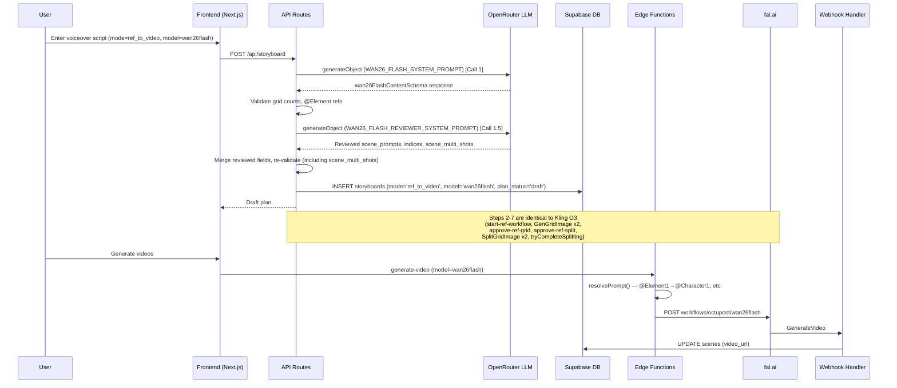

# STORYBOARD_REF_WAN_A.md — Ref-to-Video Wan 2.6 Flash Pipeline Complete Documentation

## Table of Contents
1. [Overview](#overview)
2. [How It Differs From I2V and Kling O3](#how-it-differs-from-i2v-and-kling-o3)
3. [Architecture Diagram](#architecture-diagram)
4. [Schemas](#schemas)
5. [AI Prompts (Verbatim)](#ai-prompts-verbatim)
6. [Step-by-Step Flow](#step-by-step-flow)
7. [Database Tables & State Tracking](#database-tables--state-tracking)
8. [API Routes](#api-routes)
9. [Supabase Edge Functions](#supabase-edge-functions)
10. [Webhook Handler](#webhook-handler)
11. [Video Generation — Wan-Specific](#video-generation--wan-specific)
12. [Frontend Components](#frontend-components)
13. [Error Handling](#error-handling)

---

## Overview

The Wan 2.6 Flash Ref-to-Video pipeline generates videos using reference images, similar to Kling O3 but with key differences in reference syntax, duration constraints, and multi-shot handling. The flow is structurally identical to Kling O3:

1. Two-pass LLM plan generation (content + reviewer)
2. Two grid images generated (objects + backgrounds)
3. Grids split into individual reference images
4. Videos generated with Wan 2.6 Flash model using reference images

The critical differences are in how references are expressed in prompts and how the video generation API is called.

---

## How It Differs From I2V and Kling O3

### Wan 2.6 Flash vs I2V

| Aspect | I2V | Wan 2.6 Flash |
|--------|-----|---------------|
| Grid images | 1 (scene grid) | 2 (objects + backgrounds) |
| LLM calls | 1 | 2 (content + reviewer) |
| Scene prompts | `visual_flow` (animation prompts) | `scene_prompts` with `@ElementN` references |
| DB entities | scenes, first_frames | scenes, objects, backgrounds |
| Video gen input | Single image + prompt | Background + character images + prompt |
| Storyboard mode | null | `'ref_to_video'` |
| Storyboard model | null | `'wan26flash'` |

### Wan 2.6 Flash vs Kling O3

| Aspect | Kling O3 | Wan 2.6 Flash |
|--------|----------|---------------|
| Reference syntax | `@ElementN` (objects) + `@Image1` (background) | `@Element1` (background) + `@Element2+` (objects) |
| Multi-shot | `scene_prompts: (string \| string[])[]` — array = multi-shot | `scene_prompts: string[]` always strings + `scene_multi_shots: boolean[]` flag |
| Duration buckets | 3-15 seconds (flexible) | 5 or 10 seconds only |
| Voiceover target | 3-12 seconds per segment | 5 or 10 seconds per segment |
| Max images | 4 elements + 1 background = 5 total | 5 total (1 bg + up to 4 objects) in `image_urls` |
| Object descriptions | Required (full-body HEAD TO FEET) | Simpler descriptions |
| API payload | `elements: [{frontal_image_url, reference_image_urls}]` + `image_urls: [bg]` | `image_urls: [bg, obj1, obj2, ...]` |
| Audio | Kling generates native audio | `enable_audio: false` |
| Prompt resolution | Native `@ElementN`/`@Image1` — no transformation | `@ElementN` resolved to `@CharacterN` at generation time |
| Reviewer output | `scene_prompts, scene_bg_indices, scene_object_indices` | `scene_prompts, scene_bg_indices, scene_object_indices, scene_multi_shots` |

### Key Difference: @Element Numbering

**Kling O3:**
- `@Element1` = first object in `scene_object_indices[i]`
- `@Element2` = second object
- `@Image1` = background from `scene_bg_indices[i]`
- Max `N` = `scene_object_indices[i].length`

**Wan 2.6 Flash:**
- `@Element1` = background from `scene_bg_indices[i]`
- `@Element2` = first object in `scene_object_indices[i]`
- `@Element3` = second object
- Max `N` = `scene_object_indices[i].length + 1`

---

## Architecture Diagram



---

## Schemas

### wan26FlashContentSchema (LLM output — Call 1)

**File:** `editor/src/lib/schemas/wan26-flash-plan.ts`

```typescript
export const wan26FlashElementSchema = z.object({
  name: z.string(),
  description: z.string(),
});

export const wan26FlashContentSchema = z.object({
  objects_rows: z.number().int().min(2).max(6),
  objects_cols: z.number().int().min(2).max(6),
  objects_grid_prompt: z.string(),
  objects: z.array(wan26FlashElementSchema).min(1).max(36),

  bg_rows: z.number().int().min(2).max(6),
  bg_cols: z.number().int().min(2).max(6),
  backgrounds_grid_prompt: z.string(),
  background_names: z.array(z.string()).min(1).max(36),

  scene_prompts: z.array(z.string()),
  scene_bg_indices: z.array(z.number().int().min(0)),
  scene_object_indices: z.array(z.array(z.number().int().min(0)).max(4)),
  scene_multi_shots: z.array(z.boolean()),

  voiceover_list: z.array(z.string()),
});
```

**Key difference from Kling O3:**
- `scene_prompts` is `z.array(z.string())` — always strings, never arrays
- `scene_multi_shots` is `z.array(z.boolean())` — separate flag for multi-shot behavior

### wan26FlashPlanSchema (stored plan — after language wrapping)

```typescript
export const wan26FlashPlanSchema = z.object({
  // Objects grid
  objects_rows: z.number().int().min(2).max(6),
  objects_cols: z.number().int().min(2).max(6),
  objects_grid_prompt: z.string(),
  objects: z.array(wan26FlashElementSchema).min(1).max(36),

  // Backgrounds grid
  bg_rows: z.number().int().min(2).max(6),
  bg_cols: z.number().int().min(2).max(6),
  backgrounds_grid_prompt: z.string(),
  background_names: z.array(z.string()).min(1).max(36),

  // Scene mapping
  scene_prompts: z.array(z.string()),
  scene_bg_indices: z.array(z.number().int().min(0)),
  scene_object_indices: z.array(z.array(z.number().int().min(0)).max(4)),
  scene_multi_shots: z.array(z.boolean()).optional(),

  // Voiceovers
  voiceover_list: z.record(z.string(), z.array(z.string())),
});
```

**Note:** `scene_multi_shots` is `.optional()` in the plan schema but required in the content schema.

### wan26FlashReviewerOutputSchema (LLM output — Call 1.5)

```typescript
export const wan26FlashReviewerOutputSchema = z.object({
  scene_prompts: z.array(z.string()),
  scene_bg_indices: z.array(z.number().int().min(0)),
  scene_object_indices: z.array(z.array(z.number().int().min(0)).max(4)),
  scene_multi_shots: z.array(z.boolean()),
});
```

**Key difference from Kling O3 reviewer:** Wan reviewer also outputs `scene_multi_shots`.

### Wan26FlashPlan type

```typescript
export type Wan26FlashPlan = z.infer<typeof wan26FlashPlanSchema>;
```

---

## AI Prompts (Verbatim)

### WAN26_FLASH_SYSTEM_PROMPT (Call 1)

**File:** `editor/src/lib/schemas/wan26-flash-plan.ts`

```
You are a storyboard planner for AI video generation using WAN 2.6 Flash (reference-to-video).

RULES:
1. Voiceover Splitting and Grid Planning
- Target 5 or 10 seconds of speech per voiceover segment (video can only be 5s or 10s).

2. Elements (Characters/Objects)
- Each scene can use UP TO 4 tracked elements (characters/objects) + 1 background = 5 max. Try to fill all 5 elements for consistency that would avoid the random characters appearing in the video.
- Elements are reusable across scenes. Design distinct, recognizable characters/objects.
- For each element, provide:
  - "name": short label (e.g. "Ahmed", "Cat")
  - "description": detailed visual description for AI tracking (e.g. "A young boy with brown hair wearing a blue jacket and red backpack, medium build, age 10")
- Descriptions must be specific enough that the AI can consistently track the element across frames.
- All elements must be front-facing. Do NOT use multi-view or turnaround poses.
- Valid grid sizes for objects grid: 2x2(4), 3x2(6), 3x3(9), 4x3(12), 4x4(16), 5x4(20), 5x5(25), 6x5(30), 6x6(36).

3. Backgrounds
- Maximize background reuse: prefer fewer unique backgrounds used in many scenes over many unique backgrounds used once.
- This will be more like environment of the scene they should be empty in terms of human the references will fill the environment
- Valid grid sizes for backgrounds grid: 2x2(4), 3x2(6), 3x3(9), 4x3(12), 4x4(16), 5x4(20), 5x5(25), 6x5(30), 6x6(36).

4. Scene Prompts — @Element References
- @Element1 = the background assigned to that scene (from scene_bg_indices).
- @Element2, @Element3, etc. = the characters/objects assigned to that scene (from scene_object_indices), in order.
  - @Element2 = first object in scene_object_indices[i], @Element3 = second, etc.
- CRITICAL: Do NOT reference @ElementN where N > scene_object_indices[i].length + 1.
  - Example: If scene_object_indices[i] = [0, 3], that scene has 2 objects. Use @Element1 (bg), @Element2, @Element3 ONLY.
  - Example: If scene_object_indices[i] = [2], that scene has 1 object. Use @Element1 (bg), @Element2 ONLY.
- Write vivid, cinematic shot descriptions — not generic summaries.
- Include specific camera techniques: dolly zoom, tracking shot, close-up, aerial reveal, handheld feel, rack focus, push-in, crane shot, over-the-shoulder, whip pan.
- Include lighting details: golden hour, rim light, silhouette, chiaroscuro, neon glow, natural window light, dramatic shadows.
- Include character emotions, body language, specific actions, and movements.

5. Multi-Shot Assignment
- When the voiceover describes multiple distinct actions, transitions, or camera changes, use an ARRAY of 2-3 shot prompts instead of a single string.
- When the voiceover describes a single continuous action or moment, use a single prompt string.
- Each shot uses @Element1 (background), @Element2, @Element3, etc.
- Shots should form a coherent visual sequence (establishing → action → reaction, or wide → medium → close-up).
- Use cinematic techniques: dolly zooms, tracking shots, rack focus, aerial reveals, close-ups, handheld feel.
- Max 3 shots per scene.

6. Visual & Content Rules
DO:
- The prompts will be English but the texts and style on the image will depend on the language of the voiceover.
- Use modern islamic clothing styles if people are shown. For girls use modest clothing with NO Hijab. Modern muslim fashion styles like Turkey without religious symbols.
- If the voiceover mentions real people, brands, landmarks, or locations, use their actual names and recognizable features.
DO NOT:
- Do not add any extra text like a message or overlay text — no text will be seen on the grid cell.
- Do not add any violence.


OUTPUT FORMAT:
Return valid JSON matching this structure:
{
  "objects_rows": 2, "objects_cols": 2,
  "objects_grid_prompt": "With 2 A 2x2 Grids. Grid_1x1: A young boy named Ahmed on neutral white background, front-facing. Grid_1x2: A fluffy orange tabby cat on neutral white background. Grid_2x1: ..., Grid_2x2: ...",
  "objects": [
    { "name": "Ahmed", "description": "A young boy with brown hair, blue jacket, red backpack, age 10" },
    { "name": "Cat", "description": "A fluffy orange tabby cat with green eyes and a red collar" },
     ...
  ],  "bg_rows": 2, "bg_cols": 2,
  "backgrounds_grid_prompt": "With 2 A 2x2 Grids. Grid_1x1: City street at dusk with warm streetlights. Grid_1x2: School courtyard with green trees. Grid_2x1: ..., Grid_2x2: ...",
  "background_names": ["City street at dusk", "School courtyard", "Living room", "Park"],
  "scene_prompts": [
    "@Element2 and @Element3 are having a dinner at @Element1, @Element2 says 'Naber bro nasılsın?'",
    ...
  ],
  "scene_bg_indices": [0, 1, 2, 0],
  "scene_object_indices": [[0, 1], [0], [1], [0, 1]],
  "scene_multi_shots": [true, false, false, true],
  "voiceover_list": ["segment 1 text", "segment 2 text", ...]
}
```

### WAN26_FLASH_REVIEWER_SYSTEM_PROMPT (Call 1.5)

**File:** `editor/src/lib/schemas/wan26-flash-plan.ts`

```
You are a storyboard reviewer for WAN 2.6 Flash reference-to-video generation. You receive a generated storyboard plan and must fix errors and improve prompt quality.

YOUR TASKS:

1. Fix @ElementN references
   - @Element1 = background (one per scene, from scene_bg_indices).
   - @Element2 = first object in scene_object_indices[i], @Element3 = second, etc.
   - Max valid N = scene_object_indices[i].length + 1.
   - If scene_object_indices[i] has 2 items, only @Element1, @Element2, and @Element3 are valid.
   - Fix any violations by either correcting the reference number or rewriting the prompt.

2. Improve prompt quality
   - Backgorund images should be empty places like no human etc.
   - Replace generic, summary-style, or executive-overview prompts with vivid, cinematic shot descriptions.
   - Include specific camera techniques: dolly zoom, tracking shot, close-up, aerial reveal, handheld feel, rack focus, push-in, crane shot, over-the-shoulder, whip pan.
   - Include lighting details: golden hour, rim light, silhouette, chiaroscuro, neon glow, natural window light, dramatic shadows.
   - Include character emotions, body language, specific actions, and movements.
   - Every prompt should read like a shot description from a professional film script.
   - Single-string prompts should describe one continuous shot. Array prompts (2-3 shots) should form a coherent visual sequence.
   - For scenes with scene_multi_shots = true, write prompts that contain multiple distinct actions or transitions suitable for multi-shot rendering.
   - For scenes with scene_multi_shots = false, write prompts that describe one continuous shot or single moment.

3. Decide scene_multi_shots per scene
   - Set scene_multi_shots[i] = true for dynamic scenes with multiple distinct actions, transitions, or camera changes.
   - Set scene_multi_shots[i] = false for simple, continuous moments or single actions.
   - Use arrays of 2-3 strings for voiceover segments with multiple distinct actions, transitions, or camera changes.
   - Use a single string for continuous moments or single actions.

4. Verify scene assignments
   - Check if object/background assignments make narrative sense for each scene.
   - Reassign scene_bg_indices or scene_object_indices if needed (you can change these).
   - Ensure every scene has at least one object assigned.

DO NOT CHANGE:
- The number of scenes (array lengths must stay the same)
- Object definitions, background definitions, voiceover_list, grid dimensions
- The total set of available object indices or background indices

Return ONLY the corrected scene_prompts, scene_bg_indices, scene_object_indices, and scene_multi_shots.
```

### REF_OBJECTS_GRID_PREFIX (shared with Kling O3)

**File:** `editor/src/lib/schemas/kling-o3-plan.ts`

```
Photorealistic cinematic style with natural skin texture. Grid image with each cell in the same size with 1px black grid lines. Each cell shows one character/object on a neutral white background, front-facing, full body visible from head to shoes, clearly separated. Each character must show their complete outfit clearly visible. Grid cells should be in the same size
```

### REF_BACKGROUNDS_GRID_PREFIX (shared with Kling O3)

**File:** `editor/src/lib/schemas/kling-o3-plan.ts`

```
Photorealistic cinematic style. Grid image with each cell in the same size with 1px black grid lines. Each cell shows one empty environment/location with no people, with varied cinematic camera angles (eye-level, low angle, three-quarter view, wide establishing shot). Locations should feel lived-in and atmospheric with natural lighting and environmental details. Grid cells should be in the same size
```

---

## Step-by-Step Flow

### Step 1: Plan Generation (Two-Pass LLM)

**API Call:** `POST /api/storyboard`

**File:** `editor/src/app/api/storyboard/route.ts` — `generateRefToVideoPlan()` function

**Request body:**
```json
{
  "voiceoverText": "...",
  "model": "google/gemini-3.1-pro-preview",
  "projectId": "uuid",
  "aspectRatio": "9:16",
  "mode": "ref_to_video",
  "videoModel": "wan26flash",
  "sourceLanguage": "en"
}
```

#### Call 1: Content Generation

```typescript
const isKling = false; // videoModel === 'wan26flash'
const systemPrompt = WAN26_FLASH_SYSTEM_PROMPT;
const contentSchemaForModel = wan26FlashContentSchema;

const { object: content } = await generateObjectWithFallback({
  primaryModel: llmModel,
  primaryOptions: {
    plugins: [{ id: 'response-healing' }],
    ...(isOpus(llmModel) ? {} : { reasoning: { effort: 'high' } }),
  },
  system: systemPrompt,
  prompt: `Voiceover Script:\n${voiceoverText}\n\nGenerate the storyboard.`,
  schema: contentSchemaForModel,
  label: 'ref_to_video/content',
});
```

#### Call 1.5: Reviewer/Fixer

The Wan reviewer receives `scene_multi_shots` as a mutable field (Kling does not):

```typescript
const mutableMultiShots = isKling
  ? ''
  : `\n- scene_multi_shots: ${JSON.stringify(wanContent.scene_multi_shots)}`;

const reviewerUserPrompt = `Review and improve this WAN 2.6 Flash storyboard plan.

FROZEN (do not change):
- objects (${objectCount} items): ${JSON.stringify(content.objects)}
- background_names (${expectedBgs} items): ${JSON.stringify(content.background_names)}
- voiceover_list (${sceneCount} segments): ${JSON.stringify(content.voiceover_list)}

MUTABLE (fix and improve):
- scene_prompts: ${JSON.stringify(content.scene_prompts)}
- scene_bg_indices: ${JSON.stringify(content.scene_bg_indices)}
- scene_object_indices: ${JSON.stringify(content.scene_object_indices)}
- scene_multi_shots: ${JSON.stringify(wanContent.scene_multi_shots)}

Return the corrected fields.`;

const { object: reviewed } = await generateObjectWithFallback({
  primaryModel: llmModel,
  primaryOptions: {
    plugins: [{ id: 'response-healing' }],
    ...(isOpus(llmModel) ? {} : { reasoning: { effort: 'medium' } }),
  },
  system: WAN26_FLASH_REVIEWER_SYSTEM_PROMPT,
  prompt: reviewerUserPrompt,
  schema: wan26FlashReviewerOutputSchema,
  label: 'ref_to_video/reviewer',
});
```

**After reviewer merge (Wan-specific):**
```typescript
content.scene_prompts = reviewed.scene_prompts;
content.scene_bg_indices = reviewed.scene_bg_indices;
content.scene_object_indices = reviewed.scene_object_indices;

// Merge scene_multi_shots for WAN (not Kling)
if (!isKling && 'scene_multi_shots' in reviewed) {
  wanContent.scene_multi_shots = reviewed.scene_multi_shots;
}
```

**Wan-specific validations:**
```typescript
// Validate scene_multi_shots length
if (wanContent.scene_multi_shots.length !== sceneCount) {
  throw new Error(`scene_multi_shots length mismatch`);
}

// Validate @ElementN references (Wan numbering: @Element1 = bg, @Element2+ = objects)
for (let i = 0; i < sceneCount; i++) {
  const prompt = content.scene_prompts[i] as string;
  const maxElement = content.scene_object_indices[i].length + 1; // +1 for background

  const elementRefs = [...prompt.matchAll(/@Element(\d+)/g)];
  for (const match of elementRefs) {
    const n = parseInt(match[1], 10);
    if (n < 1 || n > maxElement) {
      throw new Error(
        `Scene ${i} references @Element${n} but max is @Element${maxElement}`
      );
    }
  }
}
```

**Final plan construction (Wan-specific):**
```typescript
return {
  objects_rows: wanContent.objects_rows,
  objects_cols: wanContent.objects_cols,
  objects_grid_prompt: `${REF_OBJECTS_GRID_PREFIX} ${wanContent.objects_grid_prompt}`,
  objects: wanContent.objects,
  bg_rows: wanContent.bg_rows,
  bg_cols: wanContent.bg_cols,
  backgrounds_grid_prompt: `${REF_BACKGROUNDS_GRID_PREFIX} ${wanContent.backgrounds_grid_prompt}`,
  background_names: wanContent.background_names,
  scene_prompts: wanContent.scene_prompts,
  scene_bg_indices: wanContent.scene_bg_indices,
  scene_object_indices: wanContent.scene_object_indices,
  scene_multi_shots: wanContent.scene_multi_shots,  // Wan-specific field
  voiceover_list: { [sourceLanguage]: content.voiceover_list },
};
```

**Database insert:**
```typescript
await supabase.from('storyboards').insert({
  project_id: projectId,
  voiceover: voiceoverText,
  aspect_ratio: aspectRatio,
  plan: finalPlan,
  plan_status: 'draft',
  mode: 'ref_to_video',
  model: 'wan26flash',
});
```

### Steps 2-7: Shared with Kling O3

The following steps are identical to the Kling O3 pipeline (see `STORYBOARD_REF_KLING_A.md`):

- **Step 2:** Approve draft → `POST /api/storyboard/approve` → `start-ref-workflow`
- **Step 3:** `start-ref-workflow` creates 2 grid_images records, sends 2 parallel fal.ai requests
- **Step 4:** Webhook `GenGridImage` — waits for both grids, sets `plan_status='grid_ready'`
- **Step 5:** Approve ref grids → `POST /api/storyboard/approve-ref-grid` → `approve-ref-split`
- **Step 6:** `approve-ref-split` creates scenes (with `multi_shots` from `scene_multi_shots`), objects, backgrounds, voiceovers. Sends 2 parallel split requests
- **Step 7:** Webhook `SplitGridImage` → `handleObjectsSplit()` / `handleBackgroundsSplit()` → `tryCompleteSplitting()` atomic gate

**Wan-specific in approve-ref-grid:** The `scene_multi_shots` array is passed to `approve-ref-split`:
```typescript
body: JSON.stringify({
  ...
  scene_multi_shots: plan.scene_multi_shots ?? undefined,
  ...
})
```

**Wan-specific in approve-ref-split:** Scenes are created with `multi_shots`:
```typescript
await supabase.from('scenes').insert({
  storyboard_id,
  order: i,
  prompt: Array.isArray(scene_prompts[i]) ? null : scene_prompts[i],
  multi_prompt: Array.isArray(scene_prompts[i]) ? scene_prompts[i] : null,
  multi_shots: scene_multi_shots?.[i] ?? null,
});
```

For Wan, `scene_prompts` are always strings (never arrays), so `prompt` is always set and `multi_prompt` is always null. The `multi_shots` boolean flag tells the video model whether to treat the single prompt as a multi-shot sequence.

---

## Database Tables & State Tracking

### Same tables as Kling O3

All database tables are shared between Kling O3 and Wan 2.6 Flash. See `STORYBOARD_REF_KLING_A.md` for full table definitions.

Key differences in stored data:

| Field | Kling O3 | Wan 2.6 Flash |
|-------|----------|---------------|
| `storyboards.model` | `'klingo3'` or `'klingo3pro'` | `'wan26flash'` |
| `storyboards.plan.scene_multi_shots` | Not present | `boolean[]` |
| `scenes.prompt` | May be null (if multi-shot) | Always set (string) |
| `scenes.multi_prompt` | May contain array of shots | Always null |
| `scenes.multi_shots` | From multi_prompt existence | From `scene_multi_shots` boolean |

### plan_status lifecycle (same as Kling O3)
```
draft → generating → grid_ready → splitting → approved
                  ↘ failed     ↘ failed
```

---

## Video Generation — Wan-Specific

### Model Configuration

**File:** `supabase/functions/generate-video/index.ts`

```typescript
wan26flash: {
  endpoint: 'workflows/octupost/wan26flash',
  mode: 'ref_to_video',
  validResolutions: ['720p', '1080p'],
  bucketDuration: (raw) => (raw <= 5 ? 5 : 10),
  buildPayload: ({
    prompt, image_urls, resolution, duration, multi_shots,
  }) => ({
    prompt,
    image_urls: image_urls || [],
    resolution,
    duration: String(duration),
    enable_audio: false,
    multi_shots: multi_shots ?? false,
  }),
},
```

**Key differences from Kling O3:**
- `bucketDuration`: Only 5 or 10 seconds (vs 3-15 for Kling)
- `enable_audio: false` (Kling generates native audio)
- No `elements` field — all images go in `image_urls` array
- No `aspect_ratio` in payload
- No `multi_prompt` support in buildPayload — multi-shot is handled by `multi_shots` boolean flag

### Prompt Resolution (resolvePrompt)

**File:** `supabase/functions/generate-video/index.ts`

Wan 2.6 Flash requires `@CharacterN` syntax (not `@ElementN`), so prompts are resolved at generation time:

```typescript
function resolvePrompt(
  scenePrompt: string,
  model: string,
  objectCount: number
): string {
  let resolved = scenePrompt;

  if (model === 'wan26flash') {
    // Background is always first in image_urls → @Character1
    resolved = resolved.replaceAll(`{bg}`, `@Character1`);
    // Objects follow: @Character2, @Character3, etc.
    for (let i = 1; i <= objectCount; i++) {
      resolved = resolved.replaceAll(`{object_${i}}`, `@Character${i + 1}`);
    }
  }
  // Kling O3 prompts already use @ElementN/@Image1 natively — no resolution needed

  return resolved;
}
```

**Note:** This function resolves `{bg}` and `{object_N}` placeholders to `@CharacterN`. However, the LLM generates prompts with `@ElementN` syntax (not `{bg}`/`{object_N}`). Looking at the actual code, the LLM's `@ElementN` references are used as-is in the prompt — the resolvePrompt function handles a legacy placeholder syntax. The Wan model's fal.ai endpoint receives the prompt as-is with `@ElementN` references.

### Ref Video Context Building

Same `getRefVideoContext()` function as Kling O3 with one validation difference:

```typescript
// Validate image count limits
if (model === 'wan26flash' && objectCount + 1 > 5) {
  log.error('WAN 2.6 Flash max 5 images exceeded', {
    total: objectCount + 1,  // +1 for background
  });
  return null;
}
```

### Payload Construction for Wan 2.6 Flash

```typescript
if (model === 'wan26flash') {
  payload = modelConfig.buildPayload({
    prompt: context.prompt,
    image_url: '',
    image_urls: [context.background_url, ...context.object_urls],
    resolution,
    duration: context.duration,
    multi_shots: context.multi_shots,
  });
}
```

**Final payload sent to fal.ai:**
```json
{
  "prompt": "scene prompt with @Element1 @Element2...",
  "image_urls": [
    "background_url",
    "object1_url",
    "object2_url"
  ],
  "resolution": "720p",
  "duration": "10",
  "enable_audio": false,
  "multi_shots": true
}
```

### Wan Reference Syntax Summary

| Reference | Meaning | Mapped from |
|-----------|---------|-------------|
| `@Element1` | Background (first in `image_urls`) | `scene_bg_indices[i]` |
| `@Element2` | First object (second in `image_urls`) | `scene_object_indices[i][0]` |
| `@Element3` | Second object (third in `image_urls`) | `scene_object_indices[i][1]` |
| `@Element4` | Third object | `scene_object_indices[i][2]` |
| `@Element5` | Fourth object (max) | `scene_object_indices[i][3]` |

**Constraint:** `@ElementN` where `1 <= N <= scene_object_indices[i].length + 1`.

**Image URLs ordering:** `[background, object_0, object_1, ..., object_N]`

---

## API Routes

All API routes are shared with Kling O3. The routing logic distinguishes by `videoModel` and `storyboard.model`:

### POST /api/storyboard (Plan generation)
- `isKling = false` for wan26flash
- Uses `WAN26_FLASH_SYSTEM_PROMPT` and `wan26FlashContentSchema`
- Reviewer uses `WAN26_FLASH_REVIEWER_SYSTEM_PROMPT` and `wan26FlashReviewerOutputSchema`
- Final plan includes `scene_multi_shots` (Kling does not)

### PATCH /api/storyboard (Plan edit)
- Validates against `wan26FlashPlanSchema` when `storyboard.model` is not klingo3/klingo3pro

### POST /api/storyboard/approve-ref-grid
- Passes `scene_multi_shots: plan.scene_multi_shots ?? undefined` to approve-ref-split

---

## Supabase Edge Functions

### Shared with Kling O3
- `start-ref-workflow` — identical behavior
- `approve-ref-split` — identical behavior (stores `multi_shots` from `scene_multi_shots`)
- `webhook` — identical behavior
- `generate-tts` — identical behavior
- `generate-sfx` — identical behavior
- `edit-image` — identical behavior

### generate-video (Wan-specific path)
- Uses `wan26flash` model config
- Payload: `{ prompt, image_urls: [bg, ...objects], resolution, duration, enable_audio: false, multi_shots }`
- Duration buckets: 5 or 10 seconds only
- Max 5 images total (1 bg + 4 objects)
- `resolvePrompt()` called for placeholder resolution

---

## Frontend Components

### Shared with Kling O3
All frontend components are shared. The UI distinguishes Wan-specific behavior via:

- `storyboard.tsx`: Video model selection includes `wan26flash`
- `draft-plan-editor.tsx`: Shows multi-shots toggle for Wan plans (since `scene_multi_shots` is a separate boolean array)
- `storyboard-cards.tsx`: Model selection for video generation includes `wan26flash` option
- `ref-grid-image-review.tsx`: Same review UI for both Wan and Kling

### draft-plan-editor.tsx (Wan-specific)
- Multi-shots toggle is editable per scene (since it's a separate `boolean[]`)
- Scene prompts are always single strings (no array editing needed)

---

## Error Handling

### Shared with Kling O3
All error handling is identical to Kling O3. See `STORYBOARD_REF_KLING_A.md` for details.

### Wan-Specific Validation Errors

1. **scene_multi_shots length mismatch**: After reviewer merge, if `scene_multi_shots.length !== sceneCount`, throws error
2. **@ElementN out of bounds**: Max `N` = `scene_object_indices[i].length + 1` (not just `.length` as in Kling, because @Element1 is the background)
3. **Image count exceeded**: `objectCount + 1 > 5` — scene is skipped during video generation (not a hard error, just logged)
4. **Duration bucketing**: Videos can only be 5 or 10 seconds. Voiceover segments targeting other durations are bucketed to the nearest valid value
