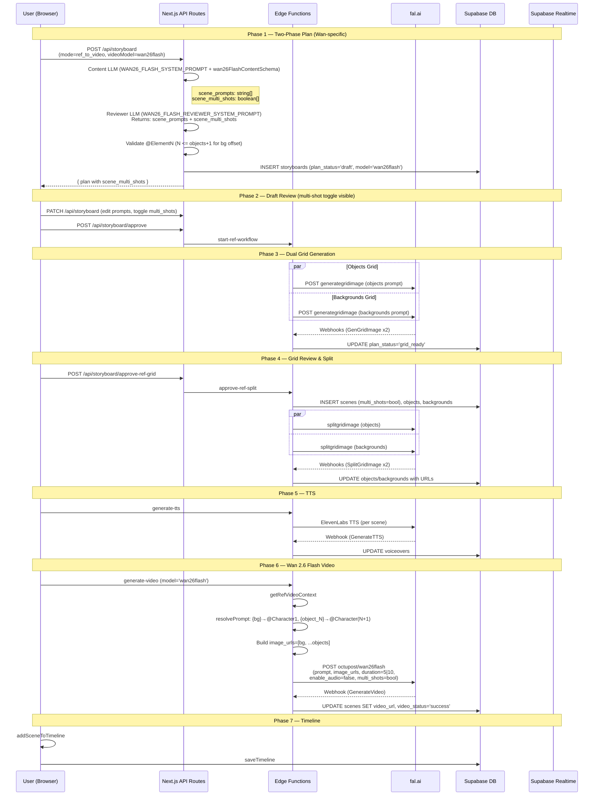

# STORYBOARD_REF_WAN_B — Ref-to-Video Wan 2.6 Flash Pipeline

## 1. Overview

The Wan 2.6 Flash Ref-to-Video pipeline is structurally similar to Kling O3 — it uses two grids (objects + backgrounds), a two-phase LLM (content + reviewer), and tracked element references. The critical difference is the **reference syntax**: Wan uses `@Element1` for **background** and `@Element2+` for **objects** (offset by 1), whereas Kling uses `@ElementN` for objects and `@Image1` for background. Additionally, Wan has `scene_multi_shots` as a boolean array (decided by the reviewer), duration buckets of only 5s or 10s, and passes `image_urls=[bg, ...objects]` instead of separate `elements[]` and `image_urls[]`.

**Key Differences from Kling O3:**
- `@Element1` = background, `@Element2+` = objects (Wan convention)
- No `@Image1` — background is `@Element1`
- `scene_prompts` is `z.array(z.string())` — always strings, never arrays (no inline multi-shot arrays in schema)
- `scene_multi_shots: z.array(z.boolean())` — reviewer decides which scenes are multi-shot
- Duration bucketing: only 5s or 10s (not 3-15)
- Payload: `image_urls=[bg, ...objects]`, `enable_audio=false`, `multi_shots` boolean
- No `elements[]` array — Wan uses flat `image_urls` list
- Prompt resolution: `{bg}` → `@Character1`, `{object_N}` → `@Character(N+1)` (runtime mapping)

---

## 2. User Journey

1. **Create**: User enters voiceover script, selects aspect ratio, AI model, video mode = "Ref", video model = "Wan 2.6 Flash", and source language.
2. **Generate Plan**: Click "Generate" → `POST /api/storyboard` (mode=`ref_to_video`, videoModel=`wan26flash`) → Two LLM calls (content + reviewer) produce a draft plan. Reviewer also decides `scene_multi_shots[]`. UI switches to **draft view**.
3. **Review Draft**: User edits in `DraftPlanEditor`:
   - Objects grid prompt, backgrounds grid prompt
   - Objects list (name + description)
   - Backgrounds list
   - Scene prompts with `@Element` reference badges
   - **Multi-shot toggle per scene** (Wan-specific, visible in draft editor)
4. **Approve Draft**: Click "Generate Grids" → `POST /api/storyboard/approve` → calls `start-ref-workflow` → two grids generated in parallel (identical to Kling).
5. **Review Grids**: `RefGridImageReview` with separate dimension editors (same as Kling).
6. **Approve Grids**: `POST /api/storyboard/approve-ref-grid` → `approve-ref-split` → creates scenes (with `multi_shots` boolean), objects, backgrounds, voiceovers. Two parallel splits.
7. **Split Completes**: Same as Kling — webhook distributes split images.
8. **Generate Voiceovers**: Same TTS pipeline.
9. **Generate Videos**: Model `wan26flash` → payload with `image_urls=[bg, ...objects]`, `enable_audio=false`, `multi_shots`.
10. **Add to Timeline**: Same as I2V/Kling.

---

## 3. Technical Flow

### 3.1 Plan Generation (Two-Phase LLM)

```
UI (storyboard.tsx) handleGenerate()
  → POST /api/storyboard (mode='ref_to_video', videoModel='wan26flash')
    → generateRefToVideoPlan(voiceoverText, llmModel, 'wan26flash', sourceLanguage)

Phase 1 — Content LLM:
  → generateObjectWithFallback({
      primaryModel: user-selected model,
      primaryOptions: { plugins: ['response-healing'], reasoning: { effort: 'high' } },
      schema: wan26FlashContentSchema,
      system: WAN26_FLASH_SYSTEM_PROMPT,
      prompt: "Voiceover Script:\n{text}\n\nGenerate the storyboard."
    })
  → Validates: objects.length == objects_rows * objects_cols
  → Validates: background_names.length == bg_rows * bg_cols

Phase 2 — Reviewer LLM:
  → generateObjectWithFallback({
      primaryModel: same model,
      primaryOptions: { plugins: ['response-healing'], reasoning: { effort: 'medium' } },
      schema: wan26FlashReviewerOutputSchema,
      system: WAN26_FLASH_REVIEWER_SYSTEM_PROMPT,
      prompt: reviewerUserPrompt (includes scene_multi_shots in MUTABLE section)
    })
  → Merges reviewed: scene_prompts, scene_bg_indices, scene_object_indices, scene_multi_shots

Post-review validation:
  → Scene count consistency
  → scene_multi_shots.length == sceneCount
  → Index bounds: scene_bg_indices[i] < expectedBgs, scene_object_indices[i][j] < objectCount
  → @ElementN validation (Wan): N must be between 1 and scene_object_indices[i].length + 1
    (+1 because @Element1 = background, @Element2+ = objects)

Final plan:
  → Prepends REF_OBJECTS_GRID_PREFIX to objects_grid_prompt
  → Prepends REF_BACKGROUNDS_GRID_PREFIX to backgrounds_grid_prompt
  → Includes scene_multi_shots in plan (Wan-specific)
  → INSERT storyboards: plan_status='draft', mode='ref_to_video', model='wan26flash'
```

### 3.2 Reviewer User Prompt (Wan — includes scene_multi_shots)

```
Review and improve this WAN 2.6 Flash storyboard plan.

FROZEN (do not change):
- objects ({objectCount} items): {JSON.stringify(content.objects)}
- background_names ({expectedBgs} items): {JSON.stringify(content.background_names)}
- voiceover_list ({sceneCount} segments): {JSON.stringify(content.voiceover_list)}

MUTABLE (fix and improve):
- scene_prompts: {JSON.stringify(content.scene_prompts)}
- scene_bg_indices: {JSON.stringify(content.scene_bg_indices)}
- scene_object_indices: {JSON.stringify(content.scene_object_indices)}
- scene_multi_shots: {JSON.stringify(content.scene_multi_shots)}

Return the corrected fields.
```

Note: The Wan reviewer prompt includes `scene_multi_shots` in the MUTABLE section, unlike Kling which omits it.

### 3.3 @ElementN Reference Validation (Wan-specific)

```typescript
// From POST /api/storyboard route.ts lines 274-289
// @Element1 = background, @Element2+ = characters from scene_object_indices
for (let i = 0; i < sceneCount; i++) {
  const prompt = content.scene_prompts[i] as string;
  const maxElement = content.scene_object_indices[i].length + 1; // +1 for background as @Element1

  const elementRefs = [...prompt.matchAll(/@Element(\d+)/g)];
  for (const match of elementRefs) {
    const n = parseInt(match[1], 10);
    if (n < 1 || n > maxElement) {
      throw new Error(
        `Scene ${i} references @Element${n} but max is @Element${maxElement} (1 bg + ${content.scene_object_indices[i].length} object(s)).`
      );
    }
  }
}
```

### 3.4 Grid Generation & Split

Identical to Kling O3. See STORYBOARD_REF_KLING_B.md Sections 3.3-3.6.

Key differences in `approve-ref-split`:
- Scenes are created with `multi_shots: scene_multi_shots?.[i] ?? null` (Wan uses this boolean)
- All other scene/object/background creation is identical

### 3.5 Video Generation (Wan 2.6 Flash)

```
generate-video edge function (ref_to_video path, model='wan26flash'):
  → getRefVideoContext(supabase, sceneId, 'wan26flash', bucketDuration):
    → Same as Kling: fetch scene prompt, objects, background, voiceover duration
    → Validates: objectCount + 1 <= 5 (Wan max 5 images total including background)
    → Duration: max voiceover → ceil → bucketDuration: raw <= 5 → 5, else → 10
    → If multi_prompt: resolveMultiPrompt with Wan mapping
    → If single: resolvePrompt with Wan mapping

  → resolvePrompt for Wan:
    resolved = scenePrompt
      .replaceAll('{bg}', '@Character1')
      .replaceAll('{object_1}', '@Character2')
      .replaceAll('{object_2}', '@Character3')
      ...etc

  → sendRefVideoRequest (model='wan26flash'):
    → payload = modelConfig.buildPayload({
        prompt: resolved,
        image_urls: [background_url, ...objectUrls],
        resolution,
        duration,
        multi_shots: context.multi_shots
      })
    → POST https://queue.fal.run/workflows/octupost/wan26flash?fal_webhook=...
```

### Wan 2.6 Flash Payload Structure

```json
{
  "prompt": "@Element2 walks through @Element1 while @Element3 follows",
  "image_urls": [
    "<background_url>",
    "<object1_url>",
    "<object2_url>"
  ],
  "resolution": "720p",
  "duration": "10",
  "enable_audio": false,
  "multi_shots": true
}
```

Note: `image_urls[0]` = background (@Character1/@Element1), `image_urls[1+]` = objects (@Character2+/@Element2+).

### Prompt Resolution Mapping

```typescript
// generate-video/index.ts resolvePrompt()
if (model === 'wan26flash') {
  // Background is always first in image_urls → @Character1
  resolved = resolved.replaceAll(`{bg}`, `@Character1`);
  // Objects follow: @Character2, @Character3, etc.
  for (let i = 1; i <= objectCount; i++) {
    resolved = resolved.replaceAll(`{object_${i}}`, `@Character${i + 1}`);
  }
}
```

Note: The LLM writes prompts using `@Element1` (bg) / `@Element2+` (objects) per the system prompt. The `resolvePrompt` function handles `{bg}`/`{object_N}` placeholders for backward compatibility. Native `@ElementN` references pass through as-is and become `@CharacterN` in the Wan fal.ai payload.

---

## 4. AI Prompts (Verbatim)

### WAN26_FLASH_SYSTEM_PROMPT

```
You are a storyboard planner for AI video generation using WAN 2.6 Flash (reference-to-video).

RULES:
1. Voiceover Splitting and Grid Planning
- Target 5 or 10 seconds of speech per voiceover segment (video can only be 5s or 10s).

2. Elements (Characters/Objects)
- Each scene can use UP TO 4 tracked elements (characters/objects) + 1 background = 5 max. Try to fill all 5 elements for consistency that would avoid the random characters appearing in the video.
- Elements are reusable across scenes. Design distinct, recognizable characters/objects.
- For each element, provide:
  - "name": short label (e.g. "Ahmed", "Cat")
  - "description": detailed visual description for AI tracking (e.g. "A young boy with brown hair wearing a blue jacket and red backpack, medium build, age 10")
- Descriptions must be specific enough that the AI can consistently track the element across frames.
- All elements must be front-facing. Do NOT use multi-view or turnaround poses.
- Valid grid sizes for objects grid: 2x2(4), 3x2(6), 3x3(9), 4x3(12), 4x4(16), 5x4(20), 5x5(25), 6x5(30), 6x6(36).

3. Backgrounds
- Maximize background reuse: prefer fewer unique backgrounds used in many scenes over many unique backgrounds used once.
- This will be more like environment of the scene they should be empty in terms of human the references will fill the environment
- Valid grid sizes for backgrounds grid: 2x2(4), 3x2(6), 3x3(9), 4x3(12), 4x4(16), 5x4(20), 5x5(25), 6x5(30), 6x6(36).

4. Scene Prompts — @Element References
- @Element1 = the background assigned to that scene (from scene_bg_indices).
- @Element2, @Element3, etc. = the characters/objects assigned to that scene (from scene_object_indices), in order.
  - @Element2 = first object in scene_object_indices[i], @Element3 = second, etc.
- CRITICAL: Do NOT reference @ElementN where N > scene_object_indices[i].length + 1.
  - Example: If scene_object_indices[i] = [0, 3], that scene has 2 objects. Use @Element1 (bg), @Element2, @Element3 ONLY.
  - Example: If scene_object_indices[i] = [2], that scene has 1 object. Use @Element1 (bg), @Element2 ONLY.
- Write vivid, cinematic shot descriptions — not generic summaries.
- Include specific camera techniques: dolly zoom, tracking shot, close-up, aerial reveal, handheld feel, rack focus, push-in, crane shot, over-the-shoulder, whip pan.
- Include lighting details: golden hour, rim light, silhouette, chiaroscuro, neon glow, natural window light, dramatic shadows.
- Include character emotions, body language, specific actions, and movements.

5. Multi-Shot Assignment
- When the voiceover describes multiple distinct actions, transitions, or camera changes, use an ARRAY of 2-3 shot prompts instead of a single string.
- When the voiceover describes a single continuous action or moment, use a single prompt string.
- Each shot uses @Element1 (background), @Element2, @Element3, etc.
- Shots should form a coherent visual sequence (establishing → action → reaction, or wide → medium → close-up).
- Use cinematic techniques: dolly zooms, tracking shots, rack focus, aerial reveals, close-ups, handheld feel.
- Max 3 shots per scene.

6. Visual & Content Rules
DO:
- The prompts will be English but the texts and style on the image will depend on the language of the voiceover.
- Use modern islamic clothing styles if people are shown. For girls use modest clothing with NO Hijab. Modern muslim fashion styles like Turkey without religious symbols.
- If the voiceover mentions real people, brands, landmarks, or locations, use their actual names and recognizable features.
DO NOT:
- Do not add any extra text like a message or overlay text — no text will be seen on the grid cell.
- Do not add any violence.


OUTPUT FORMAT:
Return valid JSON matching this structure:
{
  "objects_rows": 2, "objects_cols": 2,
  "objects_grid_prompt": "With 2 A 2x2 Grids. Grid_1x1: A young boy named Ahmed on neutral white background, front-facing. Grid_1x2: A fluffy orange tabby cat on neutral white background. Grid_2x1: ..., Grid_2x2: ...",
  "objects": [
    { "name": "Ahmed", "description": "A young boy with brown hair, blue jacket, red backpack, age 10" },
    { "name": "Cat", "description": "A fluffy orange tabby cat with green eyes and a red collar" },
     ...
  ],  "bg_rows": 2, "bg_cols": 2,
  "backgrounds_grid_prompt": "With 2 A 2x2 Grids. Grid_1x1: City street at dusk with warm streetlights. Grid_1x2: School courtyard with green trees. Grid_2x1: ..., Grid_2x2: ...",
  "background_names": ["City street at dusk", "School courtyard", "Living room", "Park"],
  "scene_prompts": [
    "@Element2 and @Element3 are having a dinner at @Element1, @Element2 says 'Naber bro nasılsın?'",
    ...
  ],
  "scene_bg_indices": [0, 1, 2, 0],
  "scene_object_indices": [[0, 1], [0], [1], [0, 1]],
  "scene_multi_shots": [true, false, false, true],
  "voiceover_list": ["segment 1 text", "segment 2 text", ...]
}
```

### WAN26_FLASH_REVIEWER_SYSTEM_PROMPT

```
You are a storyboard reviewer for WAN 2.6 Flash reference-to-video generation. You receive a generated storyboard plan and must fix errors and improve prompt quality.

YOUR TASKS:

1. Fix @ElementN references
   - @Element1 = background (one per scene, from scene_bg_indices).
   - @Element2 = first object in scene_object_indices[i], @Element3 = second, etc.
   - Max valid N = scene_object_indices[i].length + 1.
   - If scene_object_indices[i] has 2 items, only @Element1, @Element2, and @Element3 are valid.
   - Fix any violations by either correcting the reference number or rewriting the prompt.

2. Improve prompt quality
   - Backgorund images should be empty places like no human etc.
   - Replace generic, summary-style, or executive-overview prompts with vivid, cinematic shot descriptions.
   - Include specific camera techniques: dolly zoom, tracking shot, close-up, aerial reveal, handheld feel, rack focus, push-in, crane shot, over-the-shoulder, whip pan.
   - Include lighting details: golden hour, rim light, silhouette, chiaroscuro, neon glow, natural window light, dramatic shadows.
   - Include character emotions, body language, specific actions, and movements.
   - Every prompt should read like a shot description from a professional film script.
   - Single-string prompts should describe one continuous shot. Array prompts (2-3 shots) should form a coherent visual sequence.
   - For scenes with scene_multi_shots = true, write prompts that contain multiple distinct actions or transitions suitable for multi-shot rendering.
   - For scenes with scene_multi_shots = false, write prompts that describe one continuous shot or single moment.

3. Decide scene_multi_shots per scene
   - Set scene_multi_shots[i] = true for dynamic scenes with multiple distinct actions, transitions, or camera changes.
   - Set scene_multi_shots[i] = false for simple, continuous moments or single actions.
   - Use arrays of 2-3 strings for voiceover segments with multiple distinct actions, transitions, or camera changes.
   - Use a single string for continuous moments or single actions.

4. Verify scene assignments
   - Check if object/background assignments make narrative sense for each scene.
   - Reassign scene_bg_indices or scene_object_indices if needed (you can change these).
   - Ensure every scene has at least one object assigned.

DO NOT CHANGE:
- The number of scenes (array lengths must stay the same)
- Object definitions, background definitions, voiceover_list, grid dimensions
- The total set of available object indices or background indices

Return ONLY the corrected scene_prompts, scene_bg_indices, scene_object_indices, and scene_multi_shots.
```

### REF_OBJECTS_GRID_PREFIX

```
Photorealistic cinematic style with natural skin texture. Grid image with each cell in the same size with 1px black grid lines. Each cell shows one character/object on a neutral white background, front-facing, full body visible from head to shoes, clearly separated. Each character must show their complete outfit clearly visible. Grid cells should be in the same size
```

### REF_BACKGROUNDS_GRID_PREFIX

```
Photorealistic cinematic style. Grid image with each cell in the same size with 1px black grid lines. Each cell shows one empty environment/location with no people, with varied cinematic camera angles (eye-level, low angle, three-quarter view, wide establishing shot). Locations should feel lived-in and atmospheric with natural lighting and environmental details. Grid cells should be in the same size
```

(Same prefixes as Kling O3 — shared constants from `kling-o3-plan.ts`.)

---

## 5. Schemas (Verbatim)

### wan26FlashContentSchema (LLM Phase 1 output)

```typescript
// editor/src/lib/schemas/wan26-flash-plan.ts
export const wan26FlashElementSchema = z.object({
  name: z.string(),
  description: z.string(),
});

export const wan26FlashContentSchema = z.object({
  objects_rows: z.number().int().min(2).max(6),
  objects_cols: z.number().int().min(2).max(6),
  objects_grid_prompt: z.string(),
  objects: z.array(wan26FlashElementSchema).min(1).max(36),

  bg_rows: z.number().int().min(2).max(6),
  bg_cols: z.number().int().min(2).max(6),
  backgrounds_grid_prompt: z.string(),
  background_names: z.array(z.string()).min(1).max(36),

  scene_prompts: z.array(z.string()),
  scene_bg_indices: z.array(z.number().int().min(0)),
  scene_object_indices: z.array(z.array(z.number().int().min(0)).max(4)),
  scene_multi_shots: z.array(z.boolean()),

  voiceover_list: z.array(z.string()),
});
```

### wan26FlashPlanSchema (DB storage — language-keyed voiceover_list)

```typescript
export const wan26FlashPlanSchema = z.object({
  objects_rows: z.number().int().min(2).max(6),
  objects_cols: z.number().int().min(2).max(6),
  objects_grid_prompt: z.string(),
  objects: z.array(wan26FlashElementSchema).min(1).max(36),

  bg_rows: z.number().int().min(2).max(6),
  bg_cols: z.number().int().min(2).max(6),
  backgrounds_grid_prompt: z.string(),
  background_names: z.array(z.string()).min(1).max(36),

  scene_prompts: z.array(z.string()),
  scene_bg_indices: z.array(z.number().int().min(0)),
  scene_object_indices: z.array(z.array(z.number().int().min(0)).max(4)),
  scene_multi_shots: z.array(z.boolean()).optional(),

  voiceover_list: z.record(z.string(), z.array(z.string())),
});
```

### wan26FlashReviewerOutputSchema (Reviewer LLM output)

```typescript
export const wan26FlashReviewerOutputSchema = z.object({
  scene_prompts: z.array(z.string()),
  scene_bg_indices: z.array(z.number().int().min(0)),
  scene_object_indices: z.array(z.array(z.number().int().min(0)).max(4)),
  scene_multi_shots: z.array(z.boolean()),
});
```

### Key Schema Differences from Kling O3

| Field | Kling O3 | Wan 2.6 Flash |
|-------|----------|---------------|
| `scene_prompts` | `z.array(z.union([z.string(), z.array(z.string()).min(2).max(3)]))` | `z.array(z.string())` |
| `scene_multi_shots` | Not in schema | `z.array(z.boolean())` |
| Reviewer output | `scene_prompts + scene_bg_indices + scene_object_indices` | Same + `scene_multi_shots` |
| `@Element1` meaning | First object in scene | Background |
| `@Image1` | Background | Not used |

---

## 6. Grid Image Generation

Identical to Kling O3. See STORYBOARD_REF_KLING_B.md Section 6.

Two grids (objects + backgrounds) generated in parallel via `start-ref-workflow`. Same prompts, same fal.ai endpoint, same webhook pattern. `plan_status` transitions: `generating` → `grid_ready` when both grids are done.

---

## 7. Grid Splitting

Identical to Kling O3. See STORYBOARD_REF_KLING_B.md Section 7.

Two parallel splits via `approve-ref-split`. Scenes created with `multi_shots: scene_multi_shots?.[i] ?? null`. Objects and backgrounds created per-scene with `grid_position` linking to grid cell.

---

## 8. Video Generation

### Model Configuration

| Model | Endpoint | Valid Resolutions | Duration Bucketing | Max Images |
|-------|----------|-------------------|--------------------|------------|
| `wan26flash` | `workflows/octupost/wan26flash` | 720p, 1080p | 5 or 10 only | 5 (1 bg + 4 objects) |

### Duration Bucketing
```typescript
bucketDuration: (raw) => (raw <= 5 ? 5 : 10)
```
Only two possible durations: 5 seconds or 10 seconds.

### Image Count Validation
```typescript
if (model === 'wan26flash' && objectCount + 1 > 5) {
  // Max 5 images: 1 background + up to 4 objects
  return null; // skip scene
}
```

### Wan Payload Construction

```typescript
// generate-video/index.ts — wan26flash buildPayload
buildPayload: ({ prompt, image_urls, resolution, duration, multi_shots }) => ({
  prompt,
  image_urls: image_urls || [],
  resolution,
  duration: String(duration),
  enable_audio: false,
  multi_shots: multi_shots ?? false,
}),
```

### Wan sendRefVideoRequest

```typescript
if (model === 'wan26flash') {
  payload = modelConfig.buildPayload({
    prompt: context.prompt,
    image_url: '',
    image_urls: [context.background_url, ...context.object_urls],
    resolution,
    duration: context.duration,
    multi_shots: context.multi_shots,
  });
}
```

### Image URL Ordering
`image_urls[0]` = background, `image_urls[1+]` = objects (ordered by `scene_order`).

This maps to:
- `@Character1` / `@Element1` = background = `image_urls[0]`
- `@Character2` / `@Element2` = first object = `image_urls[1]`
- `@Character3` / `@Element3` = second object = `image_urls[2]`
- etc.

### Prompt Resolution

```typescript
function resolvePrompt(scenePrompt: string, model: string, objectCount: number): string {
  let resolved = scenePrompt;
  if (model === 'wan26flash') {
    resolved = resolved.replaceAll(`{bg}`, `@Character1`);
    for (let i = 1; i <= objectCount; i++) {
      resolved = resolved.replaceAll(`{object_${i}}`, `@Character${i + 1}`);
    }
  }
  return resolved;
}
```

The LLM writes prompts using `@Element1` (bg) / `@Element2+` (objects). The `resolvePrompt` function handles legacy `{bg}`/`{object_N}` placeholders. Native `@ElementN` references remain as-is in the prompt sent to fal.ai.

### Multi-Shot Handling for Wan

When `scene.multi_prompt` exists (stored as JSONB array in scenes table):
1. `resolveMultiPrompt` applies `resolvePrompt` to each shot
2. The `multi_shots` boolean from `scene.multi_shots` is passed in the payload
3. Unlike Kling, Wan doesn't use `splitMultiPromptDurations` — it sends the raw `multi_shots` flag

When `scene.prompt` is a single string:
1. `resolvePrompt` maps placeholders
2. `multi_shots` boolean still passed from scene record

### Wan 2.6 Flash Payload Example

```json
{
  "prompt": "@Element2 enters @Element1 and greets @Element3 warmly",
  "image_urls": [
    "https://...bg_image.jpg",
    "https://...object1.jpg",
    "https://...object2.jpg"
  ],
  "resolution": "720p",
  "duration": "10",
  "enable_audio": false,
  "multi_shots": true
}
```

---

## 9. TTS / Voiceover

Identical to the I2V and Kling O3 pipelines. See STORYBOARD_I2V_B.md Section 9.

### Summary
- ElevenLabs via fal.ai: `fal-ai/elevenlabs/tts/multilingual-v2`
- `{ text, voice, stability: 0.5, similarity_boost: 0.75, speed, previous_text, next_text }`
- Speed clamped 0.7-1.2
- Webhook: `step=GenerateTTS`, voiceover_id

---

## 10. Timeline Assembly

Identical to the I2V and Kling O3 pipelines. See STORYBOARD_I2V_B.md Section 10.

### Summary
- `addSceneToTimeline()`: Video.fromUrl + Audio.fromUrl
- Duration matching: slow down or speed up video (MAX_SPEED=2.0)
- `saveTimeline()`: delete-then-insert for tracks/clips

---

## 11. Database State Machine

### plan_status Transitions (Wan 2.6 Flash Ref)

```
NULL → 'draft'           (POST /api/storyboard, mode='ref_to_video', model='wan26flash')
'draft' → 'generating'   (POST /api/storyboard/approve → start-ref-workflow)
'generating' → 'grid_ready'  (webhook: BOTH grids generated)
'generating' → 'failed'      (both fal.ai requests failed)
'grid_ready' → 'splitting'   (POST /api/storyboard/approve-ref-grid → approve-ref-split)
'splitting' → completed      (webhook: all splits done)
'generating' → 'draft'       (approve route failure rollback)
```

### Storyboard Record

```
mode = 'ref_to_video'
model = 'wan26flash'
plan = {
  objects_rows, objects_cols, objects_grid_prompt, objects[],
  bg_rows, bg_cols, backgrounds_grid_prompt, background_names[],
  scene_prompts: string[],          ← always strings for Wan
  scene_bg_indices: number[],
  scene_object_indices: number[][],
  scene_multi_shots: boolean[],     ← Wan-specific
  voiceover_list: Record<string, string[]>
}
```

### Scenes Table (Wan-specific fields)

| Field | Type | Wan Usage |
|-------|------|-----------|
| `prompt` | string | Single scene prompt with @Element references |
| `multi_prompt` | string[] (JSONB) | Multi-shot prompts (from scene_multi_shots=true) |
| `multi_shots` | boolean | From plan.scene_multi_shots[i] |

### Record Lifecycle

Same as Kling O3:
- **grid_images**: `pending` → `processing` → `generated` | `failed`
- **objects**: `processing` → `success` | `failed`
- **backgrounds**: `processing` → `success` | `failed`
- **voiceovers**: `success` (text) → `processing` → `success` (audio) | `failed`
- **scenes.video_status**: NULL → `processing` → `success` | `failed`

---

## 12. Error Handling

### Wan-Specific Validations

1. **@ElementN bounds**: `N` must be between 1 and `scene_object_indices[i].length + 1`. Unlike Kling where `@Element1` is the first object, Wan's `@Element1` is the background, so the max is offset by 1.

2. **scene_multi_shots length**: Must equal sceneCount. Validated post-reviewer:
   ```typescript
   if (wanContent.scene_multi_shots.length !== sceneCount) {
     throw new Error(`scene_multi_shots length mismatch`);
   }
   ```

3. **Image count limit**: `objectCount + 1 > 5` (Wan max 5 images) → scene skipped.

4. **Duration bucketing**: Only 5s or 10s. No intermediate durations.

### Shared Error Handling
All other error handling is identical to Kling O3:
- LLM fallback to `stepfun/step-3.5-flash:free`
- Grid generation failure → `plan_status='failed'`
- Split failure → objects/backgrounds marked `failed`
- Video generation failure → `video_status='failed'`
- Dimension adjustment on grid approval (same logic)

---

## 13. Flow Diagram (Mermaid)


